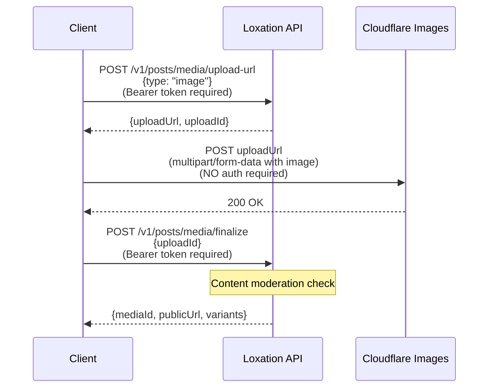
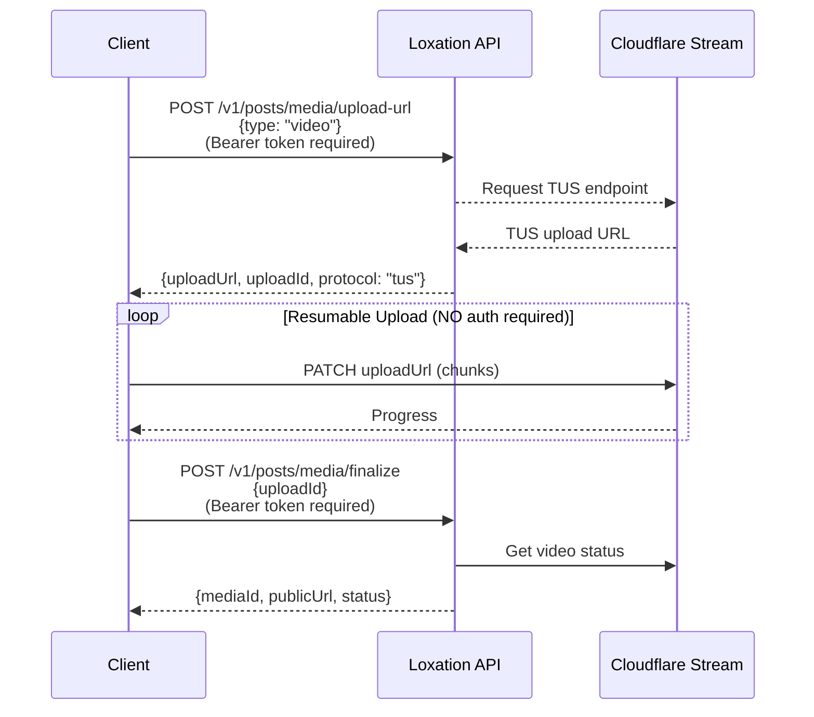

# Post Media API

Public media management for posts using Cloudflare Images and Stream.

## Overview

The Post Media API enables uploading images and videos for public posts. Media is stored on Cloudflare's CDN with:

- **Images**: Cloudflare Images with automatic variants (thumbnail, medium, large)
- **Videos**: Cloudflare Stream with HLS adaptive streaming

### Access Model

| Operation | Authentication | Description |
|-----------|---------------|-------------|
| Upload URL | Required | Get signed upload URL from API |
| Binary Upload | **None** | Direct upload to Cloudflare - no Firebase auth needed |
| Finalize | Required | Complete upload, get public URLs |
| Read/Download | **None** | Public CDN URLs - no Firebase auth needed |
| Delete | Required | Delete owned media |

> **Note:** While API endpoints require Bearer token authentication, the actual binary upload and download operations use Cloudflare's direct URLs which do **not** require Firebase authentication tokens. The Cloudflare URLs are pre-authorized and self-contained.

### URL Expiration

| Content Type | Expiration | Reason |
|--------------|------------|--------|
| Post Images | **Never** | Intentionally public content |
| Post Videos | **Never** | Intentionally public content |
| Profile Photos | 72 hours | Within-ecosystem access |
| Message Attachments | Never | E2E encrypted |

---

## Endpoints

### POST `/v1/posts/media/upload-url`

Get a signed upload URL for uploading media directly to Cloudflare.

**Authentication:** Required (Bearer token)

#### Request

```json
{
  "type": "image",
  "filename": "sunset.jpg",
  "contentType": "image/jpeg",
  "metadata": {
    "caption": "Beautiful sunset"
  }
}
```

| Field | Type | Required | Description |
|-------|------|----------|-------------|
| `type` | string | Yes | `"image"` or `"video"` |
| `filename` | string | No | Original filename |
| `contentType` | string | No | MIME type (default: `image/jpeg` or `video/mp4`) |
| `metadata` | object | No | Custom metadata to store with the media |

#### Response (Image)

```json
{
  "uploadUrl": "https://upload.imagedelivery.net/...",
  "uploadId": "abc123-def456",
  "expiresIn": 1800,
  "type": "image"
}
```

| Field | Type | Description |
|-------|------|-------------|
| `uploadUrl` | string | Cloudflare direct upload URL |
| `uploadId` | string | Media ID for finalization |
| `expiresIn` | number | Seconds until upload URL expires (30 min for images) |
| `type` | string | Media type confirmation |

#### Response (Video)

```json
{
  "uploadUrl": "https://upload.cloudflarestream.com/tus/...",
  "uploadId": "vid-xyz789",
  "expiresIn": 21600,
  "type": "video",
  "protocol": "tus"
}
```

| Field | Type | Description |
|-------|------|-------------|
| `uploadUrl` | string | TUS upload endpoint |
| `uploadId` | string | Video UID for finalization |
| `expiresIn` | number | Seconds until upload URL expires (6 hours for videos) |
| `type` | string | Media type confirmation |
| `protocol` | string | Upload protocol (`tus` for resumable uploads) |

#### Errors

| Status | Code | Description |
|--------|------|-------------|
| 400 | `invalid_request` | Invalid type or missing required fields |
| 401 | `unauthorized` | Missing or invalid bearer token |
| 503 | `service_unavailable` | Cloudflare service not configured |

---

### POST `/v1/posts/media/finalize`

Finalize an upload and retrieve public URLs. This endpoint also runs content moderation.

**Authentication:** Required (Bearer token)

#### Request

```json
{
  "uploadId": "abc123-def456"
}
```

| Field | Type | Required | Description |
|-------|------|----------|-------------|
| `uploadId` | string | Yes | The `uploadId` from upload-url response |

#### Response (Image)

```json
{
  "mediaId": "abc123-def456",
  "type": "image",
  "publicUrl": "https://imagedelivery.net/hash/abc123-def456/public",
  "variants": {
    "public": "https://imagedelivery.net/hash/abc123-def456/public",
    "thumbnail": "https://imagedelivery.net/hash/abc123-def456/thumbnail",
    "medium": "https://imagedelivery.net/hash/abc123-def456/medium",
    "large": "https://imagedelivery.net/hash/abc123-def456/large"
  }
}
```

#### Response (Video)

```json
{
  "mediaId": "vid-xyz789",
  "type": "video",
  "publicUrl": "https://videodelivery.net/vid-xyz789/manifest/video.m3u8",
  "thumbnail": "https://videodelivery.net/vid-xyz789/thumbnails/thumbnail.jpg",
  "iframe": "https://videodelivery.net/vid-xyz789/iframe",
  "status": "ready",
  "duration": 45.5
}
```

| Field | Type | Description |
|-------|------|-------------|
| `status` | string | Processing status: `pending`, `ready`, or `error` |
| `duration` | number | Video duration in seconds |

#### Content Moderation

Images are automatically checked for policy violations during finalization. If content is flagged:

```json
{
  "error": {
    "code": "content_policy_violation",
    "message": "Content contains sexual content and violates community guidelines"
  }
}
```

The flagged media is automatically deleted from Cloudflare.

#### Errors

| Status | Code | Description |
|--------|------|-------------|
| 400 | `invalid_request` | Missing uploadId |
| 400 | `content_policy_violation` | Content failed moderation |
| 401 | `unauthorized` | Missing or invalid bearer token |
| 403 | `forbidden` | Not authorized to finalize this upload |
| 404 | `not_found` | Upload not found or expired |

---

### GET `/v1/posts/media/:mediaId`

Get public URLs for media.

**Authentication:** None required (public endpoint)

#### Response (Image)

```json
{
  "mediaId": "abc123-def456",
  "type": "image",
  "publicUrl": "https://imagedelivery.net/hash/abc123-def456/public",
  "variants": {
    "public": "https://imagedelivery.net/hash/abc123-def456/public",
    "thumbnail": "https://imagedelivery.net/hash/abc123-def456/thumbnail",
    "medium": "https://imagedelivery.net/hash/abc123-def456/medium",
    "large": "https://imagedelivery.net/hash/abc123-def456/large"
  }
}
```

#### Response (Video)

```json
{
  "mediaId": "vid-xyz789",
  "type": "video",
  "publicUrl": "https://videodelivery.net/vid-xyz789/manifest/video.m3u8",
  "thumbnail": "https://videodelivery.net/vid-xyz789/thumbnails/thumbnail.jpg",
  "iframe": "https://videodelivery.net/vid-xyz789/iframe",
  "status": "ready",
  "duration": 45.5
}
```

#### Caching

Response includes cache headers:
```
Cache-Control: public, max-age=86400
```

#### Errors

| Status | Code | Description |
|--------|------|-------------|
| 400 | `invalid_request` | Missing mediaId |
| 404 | `not_found` | Media not found |

---

### DELETE `/v1/posts/media/:mediaId`

Delete owned media.

**Authentication:** Required (Bearer token)

#### Response

```json
{
  "success": true
}
```

This operation is idempotent - deleting already-deleted media returns success.

#### Errors

| Status | Code | Description |
|--------|------|-------------|
| 401 | `unauthorized` | Missing or invalid bearer token |
| 403 | `forbidden` | Not authorized to delete this media |

---

## Upload Flows

### Image Upload Flow



> **Note:** The direct upload to Cloudflare (step 2) does NOT require Firebase authentication. The presigned `uploadUrl` contains all necessary authorization.

### Video Upload Flow (TUS Protocol)



> **Note:** The direct upload to Cloudflare Stream (TUS protocol steps) does NOT require Firebase authentication. The presigned `uploadUrl` contains all necessary authorization for the entire upload session.

---

## URL Formats

### Image Delivery URLs

Format: `https://imagedelivery.net/<account_hash>/<image_id>/<variant>`

| Variant | Max Size | Use Case |
|---------|----------|----------|
| `public` | Original | Full resolution |
| `thumbnail` | 150×150 | Feed previews, lists |
| `medium` | 600×600 | In-feed display |
| `large` | 1200×1200 | Full-screen view |

### Video Delivery URLs

Format: `https://videodelivery.net/<video_uid>/<resource>`

| Resource | Description |
|----------|-------------|
| `/manifest/video.m3u8` | HLS playlist for adaptive streaming |
| `/thumbnails/thumbnail.jpg` | Auto-generated thumbnail |
| `/iframe` | Embeddable player |

---

## Integration with Posts

When creating posts with media, include the optional `mediaId` field in the `POST /v1/post/create` request:

### Request Example

```json
{
  "message": "Check out this sunset!",
  "messageId": "uuid-1234",
  "username": "johndoe",
  "contentType": "image/jpeg",
  "location": {
    "latitude": 37.7749,
    "longitude": -122.4194,
    "accuracyM": 250
  },
  "mediaId": "abc123-def456"
}
```

### Fields

| Field | Type | Required | Description |
|-------|------|----------|-------------|
| `message` | string | Yes | Post content text |
| `messageId` | string | Yes | Client-generated unique ID |
| `username` | string | Yes | Display username |
| `contentType` | string | No | MIME type (`text/plain`, `image/jpeg`, `video/mp4`, etc.) |
| `location` | object | No | Coordinates for geolocator |
| `mediaId` | string | No | Reference to finalized media from `/v1/posts/media/finalize` |

### Content Type Semantics

| contentType | mediaId | Description |
|-------------|---------|-------------|
| `text/plain` | null/absent | Text-only post (default) |
| `image/jpeg`, `image/png`, `image/gif`, `image/webp` | required | Post with image |
| `video/mp4`, `video/quicktime` | required | Post with video |

### Validation

1. If `mediaId` is provided:
   - Media must exist in `postMedia` collection
   - Authenticated device must own the media
   - `contentType` should match media type

2. If `mediaId` is absent/null:
   - `contentType` defaults to `text/plain`

### Error Responses

| Status | Code | Description |
|--------|------|-------------|
| 400 | `media_not_found` | Referenced mediaId does not exist |
| 403 | `forbidden` | Media not owned by authenticated device |

### Media Reuse

The same `mediaId` can be used in multiple posts. Media and posts have independent lifecycles:
- Deleting a post does **not** delete the associated media
- Deleting media does **not** delete posts that reference it (clients handle gracefully)

---

## Error Codes Summary

| Code | Description |
|------|-------------|
| `invalid_request` | Malformed request or missing required fields |
| `unauthorized` | Authentication required or invalid token |
| `forbidden` | User not authorized for this operation |
| `not_found` | Media or upload record not found |
| `content_policy_violation` | Content failed moderation check |
| `service_unavailable` | Cloudflare service not configured or down |
| `internal_error` | Server-side error |
