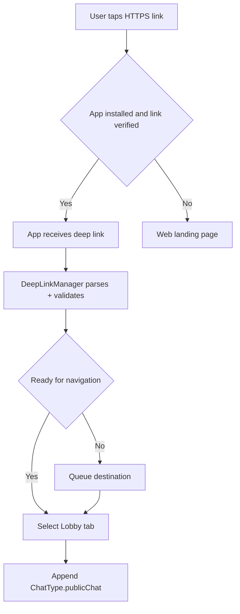

# Plan: Cross-platform HTTPS link to open Lobby → Public Chat (iOS + Android)

## Goal

Make a single HTTPS link work in Safari iOS and Android (Chrome), such that:

- If the app is installed and link verification is configured, tapping the link opens the app.
- The app navigates to **Lobby → Public Chat**.
- If EULA/auth/device registration is not complete, the app **queues the navigation** and performs it after the user completes onboarding.
- If the app is not installed or verification fails, the link opens a **web landing page** for the same path.

## Canonical link and accepted hosts

### Canonical share link (what we generate/share by default)

- `https://public.loxation.com/lobby/public-chat`

### Accepted incoming Universal/App Link hosts (verification + routing)

- `public.loxation.com`
- `www.2chanc3s.com`
- `www.3l1nk.com`

### Path allowlist (v1)

- `/lobby/public-chat` → open Lobby tab and push Public Chat.

No query params needed for v1.

## Current in-app navigation primitives (existing code)

- Lobby uses a `NavigationStack` bound to `ChatViewModel.navigationPath` at [loxation/Views/LobbyView.swift](loxation/Views/LobbyView.swift:113).
- Lobby can push Public Chat using `NavigationLink(value: ChatType.publicChat)` at [loxation/Views/LobbyView.swift](loxation/Views/LobbyView.swift:117).
- The destination enum is `ChatType` at [loxation/Views/ChatDetailView.swift](loxation/Views/ChatDetailView.swift:14).
- iOS root UI is a `TabView` created in [loxation/LoxationApp.swift](loxation/LoxationApp.swift:180). Lobby is the first tab at [loxation/LoxationApp.swift](loxation/LoxationApp.swift:182).

Implication: deep-link execution should (1) ensure the Lobby tab is selected, and (2) append `ChatType.publicChat` into `chatViewModel.navigationPath`.

## Design decisions

### 1) Verification cannot be purely dynamic

- iOS Universal Links require the hosts be declared in the **Associated Domains** entitlement at build time.
- Android App Links require the hosts be declared in the **Android manifest intent-filter** at build time.

We *can* still configure a “default share root” in iOS `Info.plist` for link generation (and similarly in Android config), but verification requires allowlisting the hosts.

### 2) Use a centralized DeepLinkManager

Add a single deep link entry point that:

- Parses incoming URLs into a small destination enum.
- Validates host + path against allowlists.
- Queues a destination when the app is not ready.
- Executes the destination when readiness gates pass.

### 3) Queueing gates

Queue deep links until:

- EULA accepted (`@AppStorage(acceptedEULA)` is used in [loxation/LoxationApp.swift](loxation/LoxationApp.swift:108)).
- Auth/device registration initialized (there is app initialization flow via services; exact readiness signal to be chosen during implementation).

When readiness becomes true, execute the pending destination once (idempotent).

## Implementation plan (iOS)

### A) Config key for canonical share URL

- Add an `Info.plist` key (iOS) e.g. `DEEPLINK_BASE_URL = https://public.loxation.com`.
- Use it only for **creating outbound links** and as a parsing convenience.

Note: Universal Link verification still requires declaring the domains in entitlements.

### B) Add deep link handlers at SwiftUI root

At the `WindowGroup` root in [loxation/LoxationApp.swift](loxation/LoxationApp.swift:176):

- Add `onOpenURL` handler (covers custom schemes and some opens).
- Add `onContinueUserActivity(NSUserActivityTypeBrowsingWeb)` handler (covers Universal Links).

Both should pass the URL into DeepLinkManager.

### C) DeepLinkManager responsibilities

Proposed API surface:

- `func handleIncomingURL(_ url: URL)`
- `func setReadyForNavigation(_ ready: Bool)`
- `@Published var pendingDestination: DeepLinkDestination?`

Where `DeepLinkDestination` includes:

- `.lobbyPublicChat`

Execution action for `.lobbyPublicChat`:

1) Switch selected tab to Lobby
2) Set `chatViewModel.navigationPath = []` (optional reset) then append `ChatType.publicChat`

### D) Tab selection approach

Currently the iOS root `TabView` in [loxation/LoxationApp.swift](loxation/LoxationApp.swift:180) has no explicit `selection` binding.

To deep-link reliably, add a `@State` selection and tag each tab:

- `.lobby`, `.profile`, `.map`, `.groups`, `.totp`, `.filters`

DeepLinkManager then sets selection to `.lobby` before pushing onto `navigationPath`.

### E) Idempotency

Ensure repeated receipt of the same deep link does not repeatedly push screens:

- If top of `navigationPath` already equals `ChatType.publicChat`, no-op.
- If pending destination already equals incoming destination, no-op.

## iOS: Universal Link server configuration (AASA)

For each host:

- `https://public.loxation.com/.well-known/apple-app-site-association`
- `https://www.2chanc3s.com/.well-known/apple-app-site-association`
- `https://www.3l1nk.com/.well-known/apple-app-site-association`

Host requirements:

- Served over HTTPS.
- No redirects.
- Correct `Content-Type` (commonly `application/json`).

App requirements:

- Add Associated Domains entitlements for:
  - `applinks:public.loxation.com`
  - `applinks:www.2chanc3s.com`
  - `applinks:www.3l1nk.com`

AASA should include only the allowlisted path `/lobby/public-chat`.

## Implementation plan (Android)

Android app identifiers:

- applicationId: `com.jabresearch.loxation`

Android tasks:

1) Add an intent-filter for `https` with:
   - hosts: `public.loxation.com`, `www.2chanc3s.com`, `www.3l1nk.com`
   - pathPrefix: `/lobby/public-chat`
   - enable `android:autoVerify=true`

2) Implement deep link routing to open the Lobby and public chat screen.

3) Implement the same “queue until ready” behavior for onboarding/auth completion.

## Android: Digital Asset Links server configuration (assetlinks.json)

For each host:

- `https://<host>/.well-known/assetlinks.json`

`assetlinks.json` must contain:

- package_name: `com.jabresearch.loxation`
- sha256_cert_fingerprints:
  - release signing key fingerprint(s)
  - debug fingerprint if you want debug builds to verify

Note: if Play App Signing is used, ensure the fingerprint matches the distributed signing cert.

## Web landing page behavior

On each host, serve a web page for:

- `https://<host>/lobby/public-chat`

Landing page should provide:

- An “Open in App” button:
  - iOS: can try `location.href = 'loxation://lobby/public-chat'` as a fallback.
  - Android: can rely on the same HTTPS link (if verified) and offer Play Store otherwise.
- App Store / Play Store links.

Avoid aggressive auto-redirect loops; prefer a user gesture.

## Security constraints

- Reject deep links whose host is not in `{public.loxation.com, www.2chanc3s.com, www.3l1nk.com}`.
- Reject paths not in allowlist.
- Deep link routing should not allow navigation into privileged/admin-only screens.

## Testing plan

### iOS

- Safari: open `https://public.loxation.com/lobby/public-chat`
  - app installed: should open app and navigate
  - app not installed: should show landing page
- Cold start vs warm start
- EULA not accepted: should open app, complete EULA, then navigate
- Auth/device not ready: should queue and navigate once ready

### Android

- Chrome: open `https://public.loxation.com/lobby/public-chat`
  - verified App Link: open app directly
  - not verified: show disambiguation/open in browser
- Cold start vs warm start
- Onboarding not complete: queue then navigate

### Infrastructure verification

- Confirm AASA reachable on all 3 hosts and not redirected.
- Confirm assetlinks.json reachable on all 3 hosts and matches the signing cert.

## Mermaid overview

## Approval checkpoint

This plan assumes:

- canonical share host: `public.loxation.com`
- accepted incoming hosts: all 3
- target destination: Lobby → Public Chat via `ChatType.publicChat`

Once approved, implementation should proceed in Code mode by updating:

- SwiftUI root handlers and tab selection in [loxation/LoxationApp.swift](loxation/LoxationApp.swift:176)
- Deep link parsing/execution with Lobby `navigationPath` at [loxation/Views/LobbyView.swift](loxation/Views/LobbyView.swift:113)
- Destination mapping to [loxation/Views/ChatDetailView.swift](loxation/Views/ChatDetailView.swift:14)
