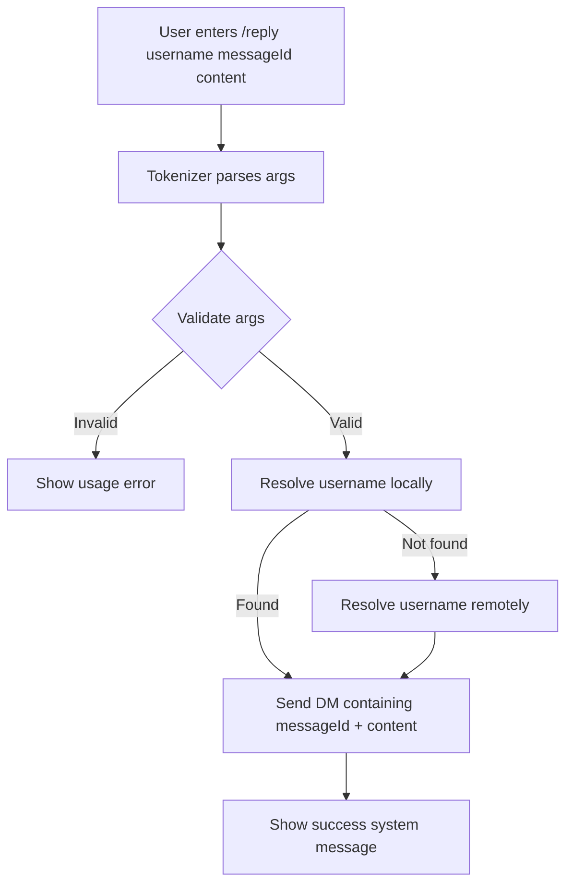

# Plan: Missed Connections-style flow (`/post`, `/reply`, enhanced `/msg`)

## Product intent

Mimic Craigslist Missed Connections using Loxation:

- Users can **publish a public post** on a website (ex: `public.loxation.com`).
- Each post has a **messageId** shown on the website.
- Other users can **DM the poster from the app** by referencing that website `messageId`.
- **Important**: `/reply` does **not** reply on the website. It only sends a **private DM** inside the app.

Primary command implementation touchpoint is [loxation/ViewModels/ChatViewModel+Commands.swift](loxation/ViewModels/ChatViewModel+Commands.swift:17).

## Commands and semantics

### 1) Enhance `/msg` to resolve unknown usernames

Goal: allow `/msg <username> <text...>` even when `<username>` is not currently in the local peer list.

Current behavior uses local nickname → `PeerID` resolution in [loxation/ViewModels/ChatViewModel+Commands.swift](loxation/ViewModels/ChatViewModel+Commands.swift:31).

Planned behavior:

1) Try local resolution (existing)
2) If not found, attempt remote resolution:
   - `username → DeviceID` and/or `username → Nostr pubkey`
3) Route DM using the best available stable identifier.

### 2) `/post <content...>` publishes a Missed Connections post

Goal: post plaintext content to a website endpoint and receive a `messageId`.

Syntax:

- `/post <content...>` (content may include spaces)

Behavior:

- Client sends a request to website API.
- Website returns canonical `messageId`.
- Client stores the `messageId` locally so the user can reference it later (copy/paste, share link, etc.).

Posting constraint (per requirement):

- Only users who have a **username** may post.
- Posting is **authenticated** (website browsing/search is anonymous).

### 3) `/reply <username> <messageId> <content...>` sends an in-app DM referencing a website post

Goal: DM a user from the context of a website post.

Syntax:

- `/reply <username> <messageId> <content...>`

Behavior:

- Resolve `<username>` (local first, then remote as in `/msg`).
- Send a private DM to the **explicit `<username>` argument** containing:
  - the reply text
  - the referenced website `messageId`
  - optionally a link to the post (if there is a canonical URL format)

**No website reply is posted.**

## Website API contract (new endpoint)

You proposed an endpoint like:

- `POST https://2chance3s/post` with JSON `{ messageId: "...", message: "..." }`

Recommended refinements to support Missed Connections and moderation:

Request:

```json
{
  "messageId": "optional client-generated id",
  "message": "plaintext post content",
  "authorHint": "optional public author handle (not necessarily app username)",
  "createdAt": "optional client timestamp",
  "signature": "optional if you want integrity"
}
```

Response:

```json
{
  "messageId": "server messageId",
  "url": "https://public.loxation.com/p/<messageId>",
  "createdAt": "iso8601"
}
```

Open decision: whether this endpoint is anonymous vs authenticated. If authenticated, align with existing token patterns (see [api/messaging.md](api/messaging.md:17)).

Decision (per requirement):

1) The website is **anonymous to read** (main page, search, view posts)
2) The website endpoint is **authenticated to post**

1) the endpoint is anonymous to read the main page, search messages etc but:
2) authenticated to post

## Parsing and quoting

The current command parser uses a whitespace split at [loxation/ViewModels/ChatViewModel+Commands.swift](loxation/ViewModels/ChatViewModel+Commands.swift:22).

To reliably support:

- `/post "content with spaces"`
- `/reply user abc123 "text with spaces"`

add a small tokenizer that supports quoted strings and escape sequences.

## Client-side architecture

### A) Remote username resolution

Add a service method to resolve unknown usernames when `/msg` and `/reply` are used.

Possible sources of truth (to confirm during implementation):

- A new REST endpoint: `GET /v1/users/resolve?username=<name>` → returns `DeviceID` and/or `npub`.
- Or leverage an existing profile/discovery endpoint if one already supports username lookup.

Integrate near [loxation/Services/LoxationApiClient.swift](loxation/Services/LoxationApiClient.swift:1).

### B) Website posting client

Add a small `WebsitePostService` responsible for:

- `post(message: String, messageId: String?) -> (messageId: String, url: URL?)`
- retry/backoff
- returning typed errors

Store minimal metadata locally:

- `messageId`
- `url` (if provided)
- `createdAt`

### C) DM payload format for `/reply`

To make the DM useful, standardize the DM content string:

- Example: `reply to post <messageId>: <content>`
- Optionally include: `<url>` if the site provides a canonical link.

## UX: system feedback

For each command, append a system message to the current chat thread indicating:

- usage errors
- resolve-in-progress
- send/post success
- failures with actionable text

## Security + abuse considerations

- Validate `messageId` format client-side (length/charset)
- Rate limit `/post`
- Consider auth/signed posts for spam control

## Implementation checklist

- [ ] Confirm final website host + endpoint URL (ex: `https://public.loxation.com/post` vs `https://2chance3s/post`).
- [ ] Implement command tokenizer (quoted args) and update parsing in [loxation/ViewModels/ChatViewModel+Commands.swift](loxation/ViewModels/ChatViewModel+Commands.swift:17).
- [ ] Enhance `/msg`:
  - attempt remote username resolution if local lookup fails
  - route DM by resolved DeviceID/npub
- [ ] Implement `/post`:
  - call website `POST /post`
  - store returned `messageId`
  - show success system message including `messageId` and link if available
- [ ] Implement `/reply`:
  - parse `username`, `messageId`, content
  - resolve username (local then remote)
  - send DM only (no website reply)
  - DM content includes the referenced `messageId` and optional URL
- [ ] Persist posted messageIds locally for convenience.
- [ ] Add unit tests for tokenizer + command parsing.

## Mermaid: `/reply` flow (DM only)


