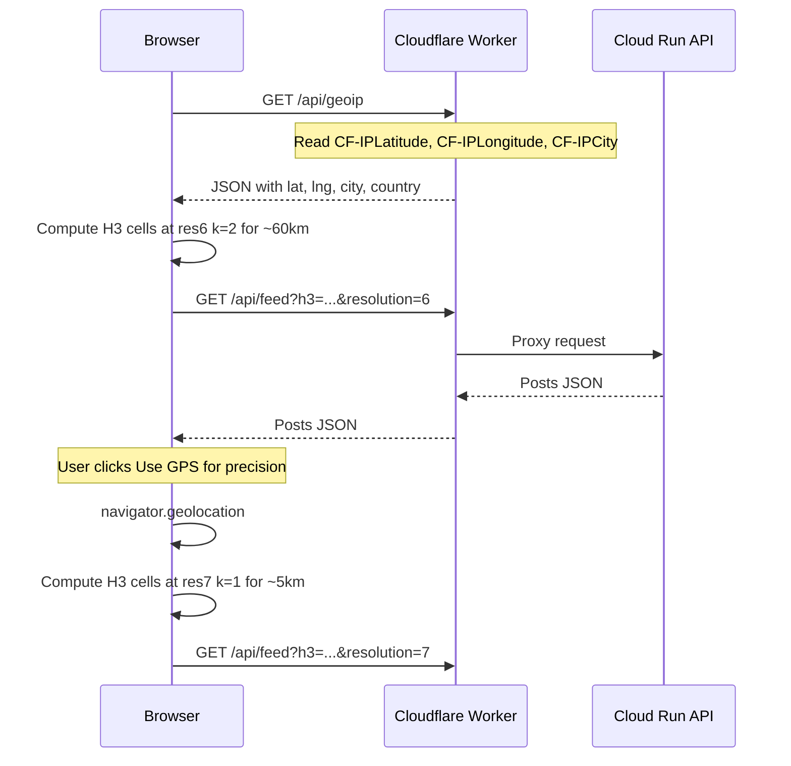

# Cloudflare IP Geolocation Plan

## Overview

Implement automatic IP-based metro-level geolocation on page load using Cloudflare's built-in geo headers, providing an immediate "posts near you" experience without requiring user action. Users can refine their location using GPS or text address.

## Current Behavior

- User must click "Use GPS" or enter an address before seeing any posts
- No automatic location detection
- Feels "empty" on first load

## Proposed Behavior

1. **Page loads** → immediately shows "Detecting your location..."
2. **IP Geolocation** → Cloudflare Worker returns approximate lat/lng from CF headers
3. **Metro-wide search** → Load posts within ~60km using H3 resolution 6
4. **User refinement** → GPS or text address for precision, defaults to smaller radius

## Architecture



## Implementation Details

### 1. Cloudflare Worker: Add `/api/geoip` endpoint

**File:** `cloudflare/workers/api-proxy/src/index.ts`

Cloudflare automatically adds these headers to incoming requests:
- `CF-IPLatitude` - approximate latitude
- `CF-IPLongitude` - approximate longitude  
- `CF-IPCity` - city name (URL encoded)
- `CF-IPCountry` - 2-letter country code

The worker intercepts `/api/geoip` and returns this data immediately without proxying to Cloud Run.

```typescript
// Add before the existing fetch handler
if (url.pathname === "/api/geoip") {
  const lat = request.headers.get("CF-IPLatitude");
  const lng = request.headers.get("CF-IPLongitude");
  const city = request.headers.get("CF-IPCity");
  const country = request.headers.get("CF-IPCountry");
  
  // Return even if some fields are missing
  return new Response(JSON.stringify({
    lat: lat ? parseFloat(lat) : null,
    lng: lng ? parseFloat(lng) : null,
    city: city ? decodeURIComponent(city) : null,
    country: country || null,
    source: "ip"
  }), {
    headers: {
      "Content-Type": "application/json",
      "Cache-Control": "private, max-age=300" // 5 min, IP-based so don't cache publicly
    }
  });
}
```

### 2. Web App: Auto-load on Page Load

**File:** `web/public/app.js`

Add a new function and call it at module initialization:

```javascript
/**
 * Get IP-based geolocation from Cloudflare
 * Returns: { lat, lng, city, country, source } or null if unavailable
 */
async function getIPGeolocation() {
  try {
    const resp = await fetch('/api/geoip');
    if (!resp.ok) return null;
    const data = await resp.json();
    if (data.lat == null || data.lng == null) return null;
    return data;
  } catch {
    return null;
  }
}

/**
 * Initialize with IP-based location on page load
 * Uses metro-wide radius (~60km) for coarse IP accuracy
 */
async function initWithIPLocation() {
  setStatus('Detecting your location...');
  
  const geo = await getIPGeolocation();
  if (!geo) {
    setStatus('Could not detect location. Enter a city/address or use GPS.');
    return;
  }
  
  // Use metro radius (k=15 maps to res6 k=2-3 per computeH3Tokens logic)
  // Actually, let's use res6 with k=2 directly for ~60km metro coverage
  const resolution = 6;
  const k = 2; // ~60km at res6
  
  const centerCell = latLngToCell(geo.lat, geo.lng, resolution);
  const cells = Array.from(gridDisk(centerCell, k));
  
  lastH3 = {
    cells,
    resolution,
    centerCell,
    r7: [],
    r8: []
  };
  
  const cityDisplay = geo.city || 'your area';
  setLocInfo(geo.lat, geo.lng, centerCell, `IP (${cityDisplay})`);
  
  await loadFeed();
}

// At the bottom of the file, replace the setStatus call with:
initWithIPLocation();
```

### 3. Radius Mapping

| Source | User Perception | H3 Resolution | k-ring | Coverage |
|--------|-----------------|---------------|--------|----------|
| IP (auto) | Metro ~60km | 6 | 2 | ~108 km² * 19 cells ≈ 2,000 km² |
| Text Address | User-selected | Per dropdown | Per dropdown | Varies |
| GPS | High precision | 7 | 1 | ~36 km² * 7 cells ≈ 250 km² |

### 4. UI Updates

**File:** `web/public/index.html`

Update the status text and consider adding a visual indicator:

- Show "via IP (Cincinnati)" when using IP geolocation
- Show "via GPS ±50m" when using precise GPS
- Show "via address (Downtown Cincinnati)" when using geocoded address

The current UI already supports this via the `setLocInfo` function - no HTML changes needed.

### 5. Fallback Handling

```javascript
async function initWithIPLocation() {
  setStatus('Detecting your location...');
  
  const geo = await getIPGeolocation();
  if (!geo) {
    // Fallback: prompt user
    setStatus('Could not detect location. Enter a city/address or use GPS.');
    return;
  }
  
  // ... proceed with IP location
}
```

## Testing Considerations

1. **Local Development** - Cloudflare geo headers won't be present locally. The `/api/geoip` endpoint should return nulls gracefully, and the app falls back to manual input.

2. **VPN Users** - IP geolocation will show the VPN exit location. This is expected behavior - they can use GPS for their true location.

3. **Edge Cases** - Some ISPs/data centers may not have geo data. The worker returns null fields, and the app handles gracefully.

## Files to Modify

1. `cloudflare/workers/api-proxy/src/index.ts` - Add `/api/geoip` endpoint
2. `web/public/app.js` - Add auto-init with IP geolocation
3. `web/public/index.html` - (Optional) Update initial status message

## Rollback

If issues arise, simply remove the `initWithIPLocation()` call and restore the original `setStatus()` message. The endpoint can remain for future use.
