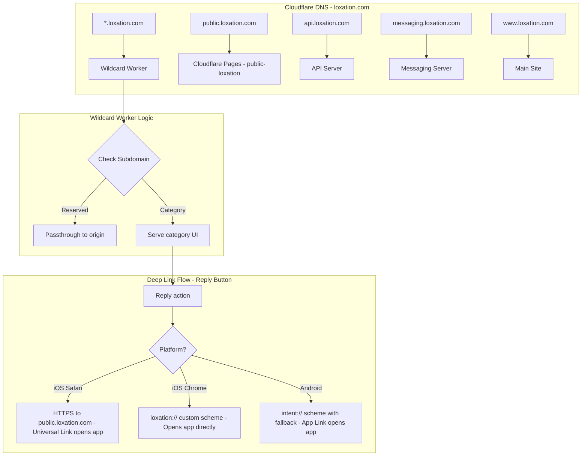

# Plan: Community Subdomain Routing System

## Overview

Enable category-based content discovery via dynamic subdomains on `*.loxation.com`. Users visiting `hiking.loxation.com` will see posts tagged with `#hiking`, while deep links for reply functionality use a hybrid approach: HTTPS links for platforms that support them, plus custom URL scheme (`loxation://`) buttons for iOS Chrome users.

## Goals

1. Serve category-filtered content at `{category}.loxation.com`
2. Maintain working deep links across all platforms (iOS Safari, iOS Chrome, Android)
3. Reserve specific subdomains for existing services (api, messaging, public, www)
4. Provide `loxation://` custom scheme buttons on all pages for iOS Chrome compatibility

---

## Architecture



---

## Reserved Subdomains

The following subdomains must NOT be handled by the wildcard worker:

| Subdomain | Purpose |
|-----------|---------|
| `public` | iOS Universal Links deep linking host |
| `api` | API server |
| `messaging` | Messaging/WebSocket server |
| `www` | Main website |

The Cloudflare Worker will check if the subdomain matches a reserved name and either passthrough or return a redirect/error.

---

## Deep Linking Strategy

### Platform Capabilities Summary

| Platform | Universal Links | Custom Scheme `loxation://` | App Links |
|----------|-----------------|------------------------------|-----------|
| iOS Safari | ✅ Works (cross-domain only) | ✅ Works | N/A |
| iOS Chrome | ❌ Not supported | ✅ Works | N/A |
| Android | N/A | ✅ Works | ✅ Works |

### Solution: Hybrid Approach

**1. iOS Safari**: Use HTTPS link to `public.loxation.com/reply?...`
   - Universal Links work because it's cross-domain navigation
   - Falls back to web page if app not installed

**2. iOS Chrome**: Use `loxation://reply?...` custom URL scheme
   - Chrome prompts user to open in Loxation app
   - If app not installed, Chrome shows error - provide fallback button to App Store

**3. Android**: Use `intent://` scheme with fallback
   - Intent URL format: `intent://reply?...#Intent;scheme=loxation;package=com.jabresearch.loxation;S.browser_fallback_url=...;end`
   - Opens app directly if installed, falls back to Play Store

### Current State

The reply page ([`web/public/reply/index.html`](web/public/reply/index.html:72)) already implements this:
```javascript
const customSchemeUrl = `loxation://reply?username=${...}&messageId=${...}`;
btnOpen.href = customSchemeUrl;

// Android uses intent:// 
if (isAndroid) {
  btnOpen.href = `intent://reply?...#Intent;scheme=loxation;...;end`;
}
```

### What Needs to Change

The main feed page ([`web/public/app.js`](web/public/app.js:53)) currently only provides HTTPS links:
```javascript
function replyUrlIOS(username, messageId) {
  return `https://public.loxation.com/reply?username=${u}&messageId=${m}`;
}
```

**Enhancement needed**: Add a visible "Open in App" button using custom scheme on all feed pages, especially for iOS Chrome users who cannot use Universal Links.

---

## Platform-Specific Behavior

### iOS Safari
1. User on `hiking.loxation.com` taps Reply link
2. Link is `https://public.loxation.com/reply?...` (cross-domain)
3. iOS fetches AASA from `public.loxation.com/.well-known/apple-app-site-association`
4. AASA matches `/reply` path → iOS opens Loxation app directly
5. If app not installed → loads reply web page with App Store link

### iOS Chrome (IMPORTANT - Universal Links don't work!)
1. User on `hiking.loxation.com` taps "Reply in App" button
2. JavaScript attempts to open `loxation://reply?...` custom scheme
3. A timer starts (1.5 seconds)
4. **If app installed**: Chrome prompts "Open in Loxation?" → user taps Open → app opens
5. **If app NOT installed**: Chrome shows error or nothing happens
6. **Fallback**: If still on page after 1.5s, JavaScript redirects to `public.loxation.com/reply?...` web page
7. Web page shows "Open in App" button + prominent App Store download link

### Android (any browser)
1. User on `hiking.loxation.com` taps Reply button
2. Button href is `intent://reply?...#Intent;scheme=loxation;package=com.jabresearch.loxation;S.browser_fallback_url=https://play.google.com/store/apps/details?id=com.jabresearch.loxation;end`
3. Android opens Loxation app directly with parameters
4. If app not installed → automatically redirects to Play Store

---

## iOS Chrome Fallback Pattern (Critical)

Since iOS Chrome doesn't support Universal Links and custom schemes have no fallback, we use a JavaScript timeout pattern:

```javascript
/**
 * Attempt to open app via custom scheme with web fallback
 * Used for iOS Chrome where Universal Links don't work
 */
function openAppWithFallback(customSchemeUrl, fallbackWebUrl) {
  // Record when we started
  const startTime = Date.now();
  
  // Flag to track if user interaction happened
  let userLeftPage = false;
  
  // Listen for visibility change (user switching to app)
  const handleVisibilityChange = () => {
    if (document.hidden) {
      userLeftPage = true;
    }
  };
  document.addEventListener('visibilitychange', handleVisibilityChange);
  
  // Attempt to open the custom scheme
  window.location.href = customSchemeUrl;
  
  // After timeout, check if we should redirect to fallback
  setTimeout(() => {
    document.removeEventListener('visibilitychange', handleVisibilityChange);
    
    // Only redirect if:
    // 1. User didn't leave the page (app didn't open)
    // 2. Page is still visible
    // 3. Enough time has passed (not instant failure)
    const elapsed = Date.now() - startTime;
    if (!userLeftPage && !document.hidden && elapsed >= 1400) {
      // App probably not installed - redirect to web fallback
      window.location.href = fallbackWebUrl;
    }
  }, 1500);
}

// Usage on feed/category pages:
function handleReplyClick(username, messageId, event) {
  const u = encodeURIComponent(username);
  const m = encodeURIComponent(messageId);
  
  if (isIOSChrome) {
    event.preventDefault();
    const customUrl = `loxation://reply?username=${u}&messageId=${m}`;
    const fallbackUrl = `https://public.loxation.com/reply?username=${u}&messageId=${m}`;
    openAppWithFallback(customUrl, fallbackUrl);
  }
  // For iOS Safari: let Universal Link handle it naturally (href is already HTTPS)
  // For Android: let intent:// handle it naturally
}
```

### Why this pattern works:
1. **User initiates action** - Tap on Reply button triggers the function
2. **Try custom scheme first** - Attempts `loxation://` which opens app if installed
3. **Visibility check** - If app opens, the browser tab becomes hidden
4. **Timeout fallback** - If page is still visible after 1.5s, assume app not installed
5. **Web fallback** - Redirect to `public.loxation.com/reply` which has App Store links

### Caveats:
- Not 100% reliable (timing can vary)
- User may see a brief error before redirect
- If user is slow to respond to "Open in app?" prompt, may redirect early

### Alternative: Two-button approach
Instead of auto-redirect, show two explicit buttons for iOS Chrome:
```html
<button onclick="window.location='loxation://reply?...'">Open in App</button>
<a href="https://public.loxation.com/reply?...">Don't have the app? Tap here</a>
```

---

## Implementation Components

### 1. Cloudflare Wildcard DNS Record

Add a wildcard CNAME or A record:
```
*.loxation.com  CNAME  category-worker.loxation.com
```

Or use a Cloudflare Worker route:
```
Route: *.loxation.com/*
Worker: category-subdomain-worker
```

### 2. Cloudflare Worker (category-subdomain-worker)

```typescript
// cloudflare/workers/category-subdomain/src/index.ts

const RESERVED_SUBDOMAINS = new Set([
  'public', 'api', 'messaging', 'www',
  // Add any other reserved subdomains here
]);

export default {
  async fetch(request: Request): Promise<Response> {
    const url = new URL(request.url);
    const host = url.hostname;
    
    // Extract subdomain from host (e.g., "hiking" from "hiking.loxation.com")
    const parts = host.split('.');
    if (parts.length < 3 || parts[parts.length - 2] !== 'loxation') {
      return new Response('Invalid host', { status: 400 });
    }
    const subdomain = parts.slice(0, -2).join('.').toLowerCase();
    
    // Check if reserved subdomain
    if (RESERVED_SUBDOMAINS.has(subdomain)) {
      // Let Cloudflare route this normally (passthrough)
      return fetch(request);
    }
    
    // Category subdomain - serve category-filtered UI
    const category = sanitizeCategory(subdomain);
    
    return serveCategoryPage(category, url.pathname, url.search);
  }
};

function sanitizeCategory(cat: string): string {
  // Remove any unsafe characters, keep alphanumeric and hyphens
  return cat.replace(/[^a-z0-9-]/g, '').substring(0, 50);
}

async function serveCategoryPage(category: string, path: string, search: string): Promise<Response> {
  // Serve HTML page with category injected
  const html = generateCategoryPageHTML(category);
  return new Response(html, {
    headers: { 'Content-Type': 'text/html;charset=utf-8' }
  });
}
```

### 3. Category Page HTML Template

The category page should:
- Display posts filtered by the category (fetched via API)
- Include Reply buttons with proper deep link strategy
- Handle platform detection for iOS Safari vs iOS Chrome vs Android

```html
<!-- Template structure -->
<!DOCTYPE html>
<html>
<head>
  <title>#${category} | Loxation</title>
  <meta name="description" content="Missed connections tagged #${category}" />
  <!-- ... other meta tags ... -->
</head>
<body>
  <header>
    <h1>#${category}</h1>
  </header>
  
  <main id="feed">
    <!-- Posts loaded via JavaScript -->
  </main>
  
  <script>
    // Platform detection
    const ua = navigator.userAgent;
    const isIOS = /iPhone|iPad|iPod/i.test(ua);
    const isAndroid = /Android/i.test(ua);
    const isSafari = /Safari/i.test(ua) && !/Chrome/i.test(ua);
    const isIOSChrome = isIOS && /CriOS/i.test(ua);
    
    // Generate appropriate reply URL based on platform
    function getReplyUrl(username, messageId) {
      const u = encodeURIComponent(username);
      const m = encodeURIComponent(messageId);
      
      if (isAndroid) {
        // Android intent:// with Play Store fallback
        return `intent://reply?username=${u}&messageId=${m}#Intent;scheme=loxation;package=com.jabresearch.loxation;S.browser_fallback_url=https://play.google.com/store/apps/details?id=com.jabresearch.loxation;end`;
      }
      
      if (isIOSChrome) {
        // iOS Chrome - use custom scheme
        return `loxation://reply?username=${u}&messageId=${m}`;
      }
      
      if (isIOS) {
        // iOS Safari - use Universal Link via public.loxation.com
        return `https://public.loxation.com/reply?username=${u}&messageId=${m}`;
      }
      
      // Desktop fallback - HTTPS link to reply page
      return `https://public.loxation.com/reply?username=${u}&messageId=${m}`;
    }
    
    // Fetch and render posts
    async function loadPosts() {
      const res = await fetch(`https://api.loxation.com/api/feed?category=${CATEGORY}`);
      const data = await res.json();
      // Render posts with reply buttons using getReplyUrl()
    }
    
    loadPosts();
  </script>
</body>
</html>
```

### 4. Update Main Site Reply Links

Update [`web/public/app.js`](web/public/app.js:53) to detect iOS Chrome and use custom scheme:

```javascript
// Platform detection - more specific for iOS Chrome
const isIOS = /iPhone|iPad|iPod/i.test(navigator.userAgent);
const isIOSChrome = isIOS && /CriOS/i.test(navigator.userAgent);
const isAndroid = /Android/i.test(navigator.userAgent);

function getReplyUrl(username, messageId) {
  const u = encodeURIComponent(username);
  const m = encodeURIComponent(messageId);
  
  if (isAndroid) {
    return `intent://reply?username=${u}&messageId=${m}#Intent;scheme=loxation;package=com.jabresearch.loxation;S.browser_fallback_url=https://play.google.com/store/apps/details?id=com.jabresearch.loxation;end`;
  }
  
  if (isIOSChrome) {
    // iOS Chrome cannot use Universal Links - use custom scheme
    return `loxation://reply?username=${u}&messageId=${m}`;
  }
  
  if (isIOS) {
    // iOS Safari - Universal Link via different domain
    return `https://public.loxation.com/reply?username=${u}&messageId=${m}`;
  }
  
  // Desktop - HTTPS to reply page
  return `https://public.loxation.com/reply?username=${u}&messageId=${m}`;
}
```

### 5. API Support for Category Filtering

Add/verify category filter support in the feed endpoint:

```typescript
// api/src/routes/feed.ts
router.get('/feed', asyncHandler(async (req, res) => {
  const { category, h3, limit } = req.query;
  
  let query = db.collection('posts').orderBy('time', 'desc');
  
  if (category) {
    query = query.where('category', '==', category);
  }
  
  // ... rest of query logic
}));
```

### 6. Firestore Index for Category

Add composite index if not present:

```json
{
  "collectionGroup": "posts",
  "queryScope": "COLLECTION",
  "fields": [
    { "fieldPath": "category", "order": "ASCENDING" },
    { "fieldPath": "time", "order": "DESCENDING" }
  ]
}
```

---

## Required Changes Summary

### Cloudflare Configuration
- [ ] Add wildcard DNS record for `*.loxation.com`
- [ ] Create Worker route for `*.loxation.com/*` (excluding reserved via Worker logic)
- [ ] Deploy category-subdomain-worker

### Cloudflare Worker
- [ ] Create new Worker project: `cloudflare/workers/category-subdomain/`
- [ ] Implement subdomain extraction and reserved check
- [ ] Implement category page HTML generation
- [ ] Configure wrangler.toml with routes

### Main Site Updates
- [ ] Update `web/public/app.js` to detect iOS Chrome (`CriOS` user agent)
- [ ] Use `loxation://` custom scheme for iOS Chrome reply links
- [ ] Keep using `public.loxation.com` HTTPS for iOS Safari
- [ ] Use `intent://` for Android with Play Store fallback

### API Enhancements
- [ ] Add/verify `category` parameter in `/api/feed` endpoint
- [ ] Add/verify `category` parameter in `/api/search` endpoint
- [ ] Add Firestore index for `category` + `time`

### Post Creation (if hashtag extraction not implemented)
- [ ] Extract first hashtag from post content
- [ ] Store as `category` field in post document

---

## Testing Checklist

### Subdomain Routing
- [ ] `hiking.loxation.com` shows only posts with `category: "hiking"`
- [ ] `public.loxation.com` still serves AASA and reply page (not caught by worker)
- [ ] `api.loxation.com` still routes to API (not caught by worker)
- [ ] Non-existent category shows empty state

### Deep Linking - iOS Safari
- [ ] On `hiking.loxation.com`, tap Reply → opens Loxation app
- [ ] URL is `https://public.loxation.com/reply?...`
- [ ] If app not installed → shows reply web page

### Deep Linking - iOS Chrome
- [ ] On `hiking.loxation.com`, tap Reply → shows "Open in Loxation?" prompt
- [ ] URL is `loxation://reply?...`
- [ ] Tap Open → app opens with correct parameters
- [ ] If app not installed → provide App Store link

### Deep Linking - Android
- [ ] On `hiking.loxation.com`, tap Reply → opens Loxation app directly
- [ ] URL is `intent://reply?...`
- [ ] If app not installed → redirects to Play Store

---

## Security Considerations

1. **Subdomain injection**: Sanitize subdomain before using as category filter
2. **Reserved subdomain bypass**: Ensure reserved check is case-insensitive
3. **XSS prevention**: Escape category name in HTML output
4. **Custom scheme abuse**: App should validate parameters from `loxation://` URLs

---

## Rollback Plan

If issues arise:
1. Remove Worker route for `*.loxation.com/*`
2. Keep `public.loxation.com` on Cloudflare Pages (unchanged)
3. Main site reply links continue working

---

## iOS Chrome Detection

To reliably detect iOS Chrome:

```javascript
const ua = navigator.userAgent;
const isIOS = /iPhone|iPad|iPod/i.test(ua);
const isIOSChrome = isIOS && /CriOS/i.test(ua);
const isIOSSafari = isIOS && /Safari/i.test(ua) && !isIOSChrome;
```

**Note**: `CriOS` is Chrome's iOS user agent identifier.

---

## Summary Table

| Component | Action |
|-----------|--------|
| DNS | Wildcard `*.loxation.com` → Worker |
| Worker | Extract subdomain, serve category-filtered UI |
| Reserved | `public`, `api`, `messaging`, `www` passthrough |
| iOS Safari | HTTPS Universal Link via `public.loxation.com` ✓ |
| iOS Chrome | Custom scheme `loxation://reply?...` ✓ |
| Android | Intent URL with Play Store fallback ✓ |
| Main site | Update to detect iOS Chrome, use appropriate URL |
| API | Add `category` filter to feed/search endpoints |
