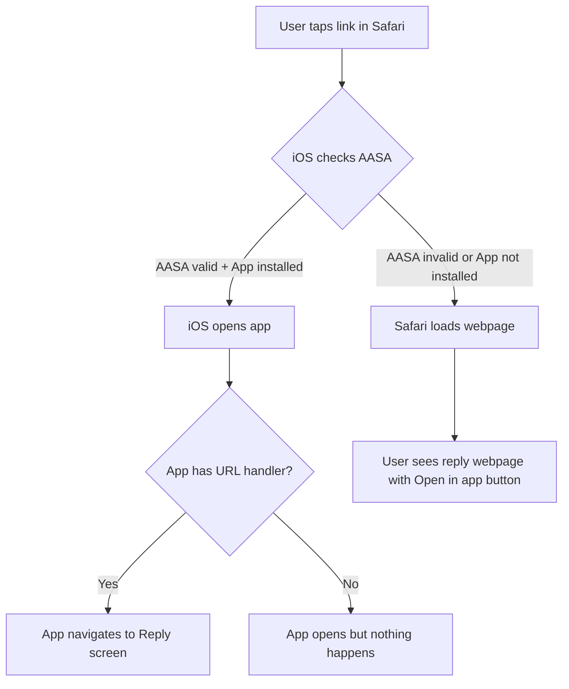

# Deep Link Fix Plan: Reply in App

## Problem Summary

The deep link `https://www.2chanc3s.com/reply?username=test&messageId=123` is not opening the Loxation app on iOS Safari, even though the app is installed.

## Root Cause Analysis

For iOS Universal Links to work, **all three components** must be correctly configured:

1. **Server-side**: `apple-app-site-association` (AASA) file
2. **App-side**: Associated Domains entitlement
3. **App-side**: URL handling code

### Current Issues Found ✅ CONFIRMED

#### Issue 1: AASA File Has Placeholder Values ❌

**Current** [`web/public/.well-known/apple-app-site-association`](web/public/.well-known/apple-app-site-association:6):
```json
"appID": "TEAM_ID.BUNDLE_ID"
```

**Should be**:
```json
"appID": "2TS8ML5579.com.jabresearch.loxation"
```

#### Issue 2: Associated Domains Entitlement MISSING ❌

**Verified in** [`loxation/loxation.entitlements`](../loxation-sw/loxation/loxation.entitlements:1):
- The file does NOT contain `com.apple.developer.associated-domains`
- This is the **primary reason** Universal Links are not working

The iOS app must have the Associated Domains capability enabled with:
```
applinks:www.2chanc3s.com
```

#### Issue 3: URL Handling Only Handles Custom Scheme ❌

**Verified in** [`loxation/LoxationApp.swift:296`](../loxation-sw/loxation/LoxationApp.swift:296):

```swift
private func handleURL(_ url: URL) {
    if url.scheme == "loxation" && url.host == "share" {
        // Handle shared content
        checkForSharedContent()
    }
}
```

The current handler ONLY handles `loxation://share` URLs. It does NOT handle:
- `https://www.2chanc3s.com/reply?...` Universal Links
- No logic to parse `username` or `messageId` from the URL

---

## Fix Plan

### Step 1: Update AASA File (Server-side)

Update [`web/public/.well-known/apple-app-site-association`](web/public/.well-known/apple-app-site-association:1) to:

```json
{
  "applinks": {
    "apps": [],
    "details": [
      {
        "appID": "2TS8ML5579.com.jabresearch.loxation",
        "paths": [
          "/reply",
          "/reply/*"
        ]
      }
    ]
  }
}
```

**Notes:**
- Added `/reply/*` to handle query parameters
- The `appID` format is: `{TeamID}.{BundleID}`

### Step 2: Deploy and Verify AASA Accessibility

After deploying, verify the AASA file is accessible:

```bash
curl -I https://www.2chanc3s.com/.well-known/apple-app-site-association
```

**Requirements:**
- HTTP 200 status
- `Content-Type: application/json`
- No redirects (must be direct HTTPS)
- Valid SSL certificate

You can also use Apple's validator:
- https://search.developer.apple.com/appsearch-validation-tool/
- Enter: `https://www.2chanc3s.com`

### Step 3: Configure Associated Domains in iOS App

In Xcode:

1. Open project in Xcode
2. Select your app target
3. Go to **Signing & Capabilities** tab
4. Click **+ Capability**
5. Add **Associated Domains**
6. Add entry: `applinks:www.2chanc3s.com`

The entitlement file should contain:
```xml
<key>com.apple.developer.associated-domains</key>
<array>
    <string>applinks:www.2chanc3s.com</string>
</array>
```

### Step 4: Implement URL Handling in iOS App

Add URL handling to the SwiftUI app root. Example implementation:

```swift
// In LoxationApp.swift or main App struct
@main
struct LoxationApp: App {
    var body: some Scene {
        WindowGroup {
            ContentView()
                .onOpenURL { url in
                    handleDeepLink(url)
                }
                .onContinueUserActivity(NSUserActivityTypeBrowsingWeb) { userActivity in
                    if let url = userActivity.webpageURL {
                        handleDeepLink(url)
                    }
                }
        }
    }
    
    func handleDeepLink(_ url: URL) {
        // Parse URL and navigate
        guard let components = URLComponents(url: url, resolvingAgainstBaseURL: true),
              components.path == "/reply" else {
            return
        }
        
        let username = components.queryItems?.first(where: { $0.name == "username" })?.value
        let messageId = components.queryItems?.first(where: { $0.name == "messageId" })?.value
        
        // Navigate to reply screen with username and messageId
        // ...
    }
}
```

### Step 5: Rebuild and Reinstall App

**Important:** After adding Associated Domains:
1. Build the app in Xcode
2. **Delete** the existing app from your device
3. **Reinstall** the app fresh
4. iOS caches association data - reinstalling forces a refresh

### Step 6: Test the Deep Link

1. Open Safari on iOS
2. Navigate to: `https://www.2chanc3s.com/reply?username=test&messageId=123`
3. If working: App should open automatically or show a banner to open in app
4. If not working: Page loads in browser instead

---

## Debugging Checklist

### Server-side Verification

- [ ] AASA file accessible at `https://www.2chanc3s.com/.well-known/apple-app-site-association`
- [ ] Returns HTTP 200 (no redirects)
- [ ] Content-Type is `application/json`
- [ ] Contains correct appID: `2TS8ML5579.com.jabresearch.loxation`
- [ ] Path `/reply` or `/reply/*` is in the paths array
- [ ] Apple validation tool shows no errors

### App-side Verification

- [ ] Associated Domains capability added in Xcode
- [ ] `applinks:www.2chanc3s.com` entry exists
- [ ] URL handling code implemented
- [ ] App was reinstalled after adding entitlement
- [ ] App is signed with correct Team ID (2TS8ML5579)

### Testing Tips

1. **Clear Safari data**: Settings → Safari → Clear History and Website Data
2. **Restart device**: Sometimes helps refresh Universal Link associations
3. **Check Console.app**: On Mac, connect device and filter for `swcd` to see association errors
4. **Test with Notes app**: Type the URL in Notes, then tap it - this bypasses Safari's same-domain blocking

---

## Common Pitfalls

1. **Same-domain blocking**: Safari won't trigger Universal Links if you're already on the same domain. Test from a different site or Notes app.

2. **Development vs Production**: Development builds may not verify associations. Test with TestFlight or release builds.

3. **Caching**: iOS aggressively caches AASA files. After server changes, reinstall the app.

4. **HTTPS required**: AASA must be served over HTTPS with valid certificate.

5. **No redirects**: The AASA URL cannot redirect. It must respond directly.

---

## Architecture Diagram



---

## Next Steps

1. **Immediate**: Update the AASA file with correct appID and deploy
2. **Verify**: Check AASA is accessible and valid using Apple's tool
3. **App work**: Confirm/add Associated Domains entitlement in Xcode
4. **App work**: Confirm/add URL handling code in app
5. **Test**: Reinstall app and test deep link from Notes app

Would you like me to proceed with updating the AASA file now?
