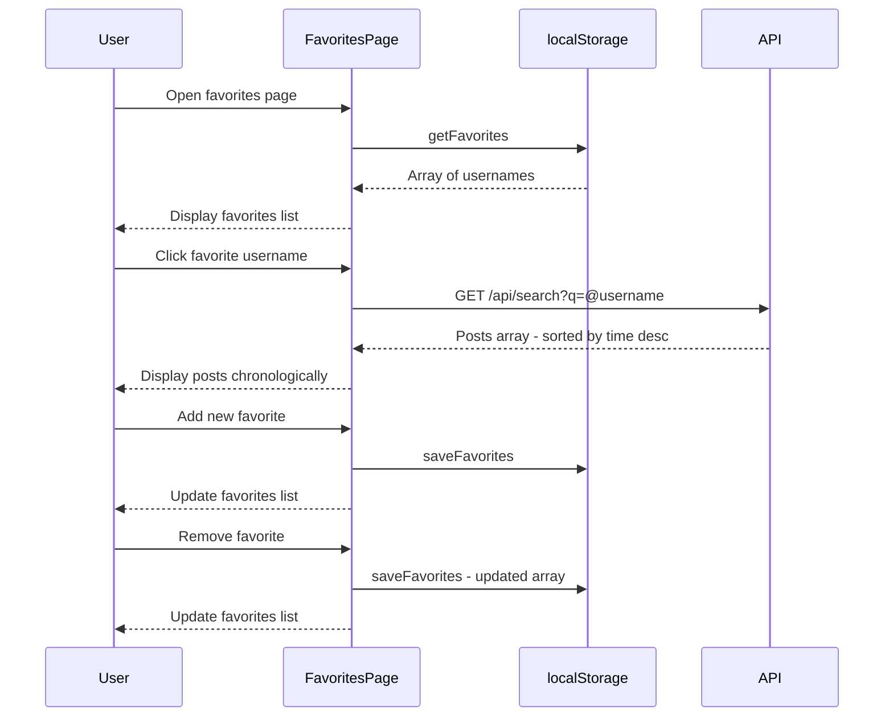

# Header Navigation Implementation Plan

## Overview

Add navigation to the 2chanc3s website header with links to:
1. **About** - A page describing the site
2. **Favorites** - A page to manage favorite users and view their posts chronologically

## Current State Analysis

### Existing Components
- **Header** ([`web/public/index.html:84-87`](web/public/index.html:84)): Simple header with title and tagline
- **API** ([`api/src/routes/search.ts:169-208`](api/src/routes/search.ts:169)): Already supports `@username` search globally (no location filter)
- **Styling** ([`web/public/style.css:17-28`](web/public/style.css:17)): `.top` class for header

### Key API Capability
The `/api/search?q=@username` endpoint already fetches all posts by a user regardless of location, returning them sorted by time descending. This eliminates the need for any backend changes.

## Architecture

```mermaid
flowchart TB
    subgraph Header Navigation
        H[Header with Nav Links]
        H --> Home[Home - index.html]
        H --> About[About - about.html]
        H --> Fav[Favorites - favorites.html]
    end
    
    subgraph Favorites Page
        Fav --> LS[localStorage]
        LS --> |Read/Write| FavList[Favorite Users List]
        Fav --> |@username search| API[/api/search]
        API --> Posts[User Posts - chronological]
    end
```

## Implementation Details

### 1. Header Navigation Updates

**File: `web/public/index.html`**

Update the header section to include navigation:

```html
<header class="top">
  <div class="header-main">
    <h1><a href="/">2chanc3s</a></h1>
    <div class="tag">second chances - nearby</div>
  </div>
  <nav class="nav">
    <a href="/about.html">About</a>
    <a href="/favorites.html">Favorites</a>
  </nav>
</header>
```

### 2. CSS Updates

**File: `web/public/style.css`**

Add navigation styling:

```css
/* Header layout with navigation */
.top {
  border-bottom: 1px solid var(--line);
  padding: 14px 16px;
  background: var(--paper);
  display: flex;
  justify-content: space-between;
  align-items: center;
  flex-wrap: wrap;
  gap: 10px;
}

.header-main h1 {
  margin: 0;
  font-size: 20px;
}

.header-main h1 a {
  color: inherit;
  text-decoration: none;
}

.header-main h1 a:hover {
  color: var(--accent);
}

.nav {
  display: flex;
  gap: 16px;
}

.nav a {
  color: var(--ink);
  text-decoration: none;
  font-size: 14px;
  padding: 4px 8px;
  border: 1px solid transparent;
}

.nav a:hover {
  color: var(--accent);
  border-color: var(--accent);
}

.nav a.active {
  color: var(--accent);
  border-color: var(--line);
}
```

### 3. About Page

**File: `web/public/about.html`**

Simple static page describing the site:

```html
<!doctype html>
<html lang="en">
<head>
  <!-- Standard meta tags, same as index.html -->
  <title>About — 2chanc3s</title>
  <link rel="stylesheet" href="/style.css" />
</head>
<body>
  <header class="top">
    <!-- Same nav as index.html -->
  </header>
  
  <main class="wrap">
    <article class="about-content">
      <h2>About 2chanc3s</h2>
      <p>2chanc3s is a platform for second chances...</p>
      <!-- Content about the site -->
    </article>
  </main>
  
  <footer class="foot">
    <!-- Same footer -->
  </footer>
</body>
</html>
```

### 4. Favorites Page

**File: `web/public/favorites.html`**

Page structure with user management and post list:

```html
<!doctype html>
<html lang="en">
<head>
  <!-- Standard meta tags -->
  <title>Favorites — 2chanc3s</title>
  <link rel="stylesheet" href="/style.css" />
</head>
<body>
  <header class="top">
    <!-- Same nav -->
  </header>
  
  <main class="wrap">
    <section class="panel favorites-panel">
      <h2>Favorite Users</h2>
      
      <!-- Add favorite form -->
      <div class="row">
        <input id="newFavorite" type="text" placeholder="Enter username" />
        <button id="btnAddFavorite">Add to Favorites</button>
      </div>
      
      <!-- Favorites list -->
      <div id="favoritesList" class="favorites-list">
        <!-- Dynamically populated -->
      </div>
    </section>
    
    <!-- Posts from selected favorite -->
    <section id="list" class="list">
      <div class="empty-state">Select a favorite user to view their posts</div>
    </section>
  </main>
  
  <footer class="foot">
    <!-- Same footer -->
  </footer>
  
  <script type="module" src="/favorites.js"></script>
</body>
</html>
```

### 5. Favorites JavaScript

**File: `web/public/favorites.js`**

localStorage management and API integration:

```javascript
// localStorage key
const FAVORITES_KEY = '2chanc3s_favorites';

// Load favorites from localStorage
function getFavorites() {
  try {
    const stored = localStorage.getItem(FAVORITES_KEY);
    return stored ? JSON.parse(stored) : [];
  } catch {
    return [];
  }
}

// Save favorites to localStorage
function saveFavorites(favorites) {
  localStorage.setItem(FAVORITES_KEY, JSON.stringify(favorites));
}

// Add a favorite user
function addFavorite(username) {
  const normalized = username.replace(/^@/, '').trim().toLowerCase();
  if (!normalized) return false;
  
  const favorites = getFavorites();
  if (favorites.includes(normalized)) return false;
  
  favorites.push(normalized);
  saveFavorites(favorites);
  return true;
}

// Remove a favorite user
function removeFavorite(username) {
  const favorites = getFavorites();
  const filtered = favorites.filter(u => u !== username);
  saveFavorites(filtered);
}

// Fetch posts for a user via the existing search API
async function fetchUserPosts(username) {
  const response = await fetch(`/api/search?q=@${encodeURIComponent(username)}&limit=100`);
  const data = await response.json();
  return data.posts || [];
}

// Render favorites list
function renderFavorites() {
  const list = document.getElementById('favoritesList');
  const favorites = getFavorites();
  
  if (favorites.length === 0) {
    list.innerHTML = '<div class="empty-state">No favorites yet. Add a username above.</div>';
    return;
  }
  
  list.innerHTML = favorites.map(username => `
    <div class="favorite-item" data-username="${username}">
      <button class="favorite-name" onclick="selectFavorite('${username}')">
        @${username}
      </button>
      <button class="favorite-remove" onclick="handleRemove('${username}')" title="Remove">×</button>
    </div>
  `).join('');
}

// Select a favorite and load their posts
async function selectFavorite(username) {
  // Update UI to show selected state
  document.querySelectorAll('.favorite-item').forEach(el => {
    el.classList.toggle('selected', el.dataset.username === username);
  });
  
  // Show loading state
  const list = document.getElementById('list');
  list.innerHTML = '<div class="status">Loading posts...</div>';
  
  // Fetch and render posts
  const posts = await fetchUserPosts(username);
  renderPosts(posts, username);
}

// Render posts list - similar to app.js but simpler
function renderPosts(posts, username) {
  const list = document.getElementById('list');
  
  if (posts.length === 0) {
    list.innerHTML = `<div class="empty-state">No posts found for @${username}</div>`;
    return;
  }
  
  list.innerHTML = posts.map(post => `
    <article class="post">
      <div class="meta">
        <span>@${post.username}</span>
        <span>${new Date(post.time).toLocaleString()}</span>
      </div>
      <div class="content">${escapeHtml(post.content)}</div>
      <!-- Media and reply buttons similar to main app -->
    </article>
  `).join('');
}
```

## Data Flow



## Files to Create/Modify

| File | Action | Description |
|------|--------|-------------|
| `web/public/index.html` | Modify | Add navigation to header |
| `web/public/style.css` | Modify | Add nav styles, favorites styles |
| `web/public/about.html` | Create | Static about page |
| `web/public/favorites.html` | Create | Favorites management page |
| `web/public/favorites.js` | Create | localStorage and API logic |

## No Backend Changes Needed

The existing `/api/search?q=@username` endpoint already:
- Queries posts by exact username match
- Returns posts sorted by time descending
- Works without location filtering when no H3 params provided
- Includes media resolution

## Testing Checklist

- [ ] Navigation links appear on all pages
- [ ] Navigation links work and highlight active page
- [ ] About page displays correctly
- [ ] Favorites page loads with empty state
- [ ] Can add a username to favorites
- [ ] Can remove a username from favorites  
- [ ] Clicking a favorite loads their posts
- [ ] Posts display in chronological order - newest first
- [ ] Favorites persist across page refreshes
- [ ] Reply links work on favorites posts
- [ ] Media displays correctly in favorites posts
