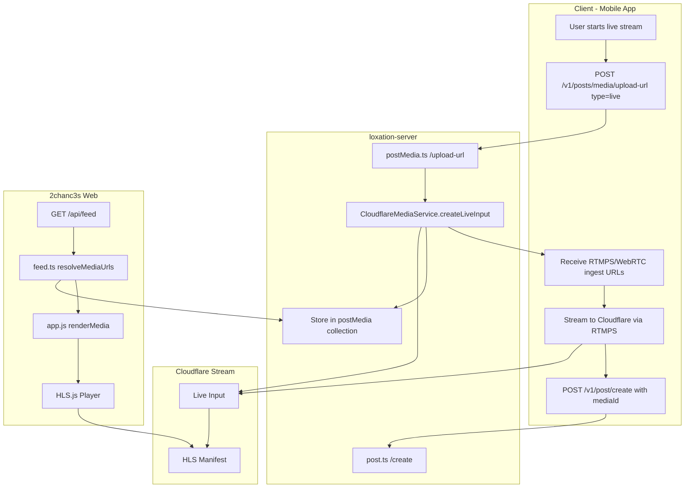

# Live Post Feature Integration Plan

## Overview

This plan documents how to integrate the 'live' post feature from loxation-server into the 2chanc3s web application. Live posts use Cloudflare Stream Live for real-time video streaming with HLS playback.

## Architecture



## Data Flow

### 1. Live Stream Creation (loxation-server)

When a mobile user creates a live stream:

1. **Request upload URL**: `POST /v1/posts/media/upload-url` with `{type: 'live'}`
2. **Server creates Cloudflare Live Input** via [`CloudflareMediaService.createLiveInput()`](../loxation-server/src/services/providers/cloudflare/media.ts:379)
3. **Server stores in Firestore** `postMedia` collection:
   ```typescript
   {
     mediaId: liveInputId,
     type: 'live',
     deviceId: string,
     locationId: string,
     title: string,
     publicUrl: 'https://customer-xxx.cloudflarestream.com/{uid}/manifest/video.m3u8',
     iframe: 'https://customer-xxx.cloudflarestream.com/{uid}/iframe',
     status: 'created' | 'live' | 'ended',
     recordToVod: boolean,
     createdAt: ISO8601
   }
   ```
4. **Response to client** includes ingest URLs (NOT stored in DB for security):
   ```json
   {
     "uploadId": "live-input-uid",
     "type": "live",
     "ingestUrl": "rtmps://live.cloudflare.com:443/live/...",
     "webrtcUrl": "https://customer-xxx.cloudflarestream.com/.../webRTC/publish",
     "playbackUrl": "https://customer-xxx.cloudflarestream.com/.../manifest/video.m3u8"
   }
   ```

### 2. Attaching Live Stream to Post

The user creates a post with the live stream:

```json
POST /v1/post/create
{
  "message": "I'm live!",
  "messageId": "client-uuid",
  "username": "streamer123",
  "mediaId": "live-input-uid"
}
```

### 3. Feed Query (2chanc3s API)

The [`resolveMediaUrls()`](api/src/routes/feed.ts:36) function currently handles `image` and `video` but logs "Unknown media type" for `live`:

```typescript
// Current code - line 91-93
} else {
  console.log(`[resolveMediaUrls] Unknown media type: ${data.type}`);
}
```

### 4. Web Display (2chanc3s Frontend)

The [`renderMedia()`](web/public/app.js:67) function handles `image` and `video` but has no `live` case.

---

## Implementation Tasks

### Task 1: Update API Feed Route (api/src/routes/feed.ts)

**File**: [`api/src/routes/feed.ts`](api/src/routes/feed.ts)

Add `live` type handling in [`resolveMediaUrls()`](api/src/routes/feed.ts:36):

```typescript
// Add after line 89 (video handling)
} else if (data.type === 'live') {
  result.set(docId, {
    type: 'live',
    stream: data.publicUrl,       // HLS manifest URL
    iframe: data.iframe,          // Embeddable player URL
    status: data.status,          // 'created' | 'live' | 'ended'
    title: data.title,
  });
}
```

**Also update** [`MediaDoc`](api/src/routes/feed.ts:14) type to include live fields:

```typescript
type MediaDoc = {
  mediaId: string;
  type: 'image' | 'video' | 'live';
  publicUrl: string;
  // ... existing fields ...
  // Live stream fields
  title?: string;
  status?: 'created' | 'live' | 'ended';
};
```

### Task 2: Update API Types (api/src/types.ts)

**File**: [`api/src/types.ts`](api/src/types.ts)

Update [`MediaInfo`](api/src/types.ts:18) to include live-specific fields:

```typescript
export type MediaInfo = {
  type: 'image' | 'video' | 'live';
  thumbnail?: string;
  medium?: string;
  large?: string;
  public?: string;
  stream?: string;
  duration?: number;
  // Live stream fields
  iframe?: string;
  status?: 'created' | 'live' | 'ended';
  title?: string;
};
```

### Task 3: Add Live Rendering in Web App (web/public/app.js)

**File**: [`web/public/app.js`](web/public/app.js)

Add `live` type handling in [`renderMedia()`](web/public/app.js:67):

```javascript
// Add after video handling (around line 143)
if (media.type === 'live') {
  const streamUrl = media.stream;
  const title = media.title || 'Live Stream';
  const status = media.status || 'live';
  
  if (!streamUrl) return '';
  
  // Generate unique ID for this video element
  const videoId = 'live-' + Math.random().toString(36).slice(2, 9);
  
  // Show status indicator
  const statusBadge = status === 'live' 
    ? '<span class="live-badge">🔴 LIVE</span>'
    : status === 'ended'
      ? '<span class="live-badge ended">Stream ended</span>'
      : '<span class="live-badge waiting">Starting soon...</span>';
  
  // Use same HLS.js approach as video
  const isSafari = /Safari/.test(navigator.userAgent) && !/Chrome/.test(navigator.userAgent);
  const hasNativeHLS = isIOS || isSafari;
  
  if (hasNativeHLS) {
    return `
      <div class="post-media video-container live-container">
        ${statusBadge}
        <video
          id="${videoId}"
          src="${escapeText(streamUrl)}"
          controls
          playsinline
          muted
          preload="metadata"
          webkit-playsinline="true"
        >
          <source src="${escapeText(streamUrl)}" type="application/vnd.apple.mpegurl">
          Your browser does not support live playback.
        </video>
        <button class="unmute-btn" aria-label="Unmute">🔇</button>
      </div>
    `;
  } else {
    return `
      <div class="post-media video-container live-container">
        ${statusBadge}
        <video
          id="${videoId}"
          controls
          playsinline
          muted
          preload="none"
          data-stream="${escapeText(streamUrl)}"
          data-live="true"
        >
          Your browser does not support live playback.
        </video>
        <button class="unmute-btn" aria-label="Unmute">🔇</button>
      </div>
    `;
  }
}
```

### Task 4: Add Live-specific CSS (web/public/style.css)

Add styling for live stream indicators:

```css
/* Live stream badge */
.live-container {
  position: relative;
}

.live-badge {
  position: absolute;
  top: 10px;
  left: 10px;
  background: #ff0000;
  color: white;
  padding: 4px 8px;
  border-radius: 4px;
  font-size: 12px;
  font-weight: bold;
  z-index: 10;
  animation: pulse 2s infinite;
}

.live-badge.ended {
  background: #666;
  animation: none;
}

.live-badge.waiting {
  background: #f59e0b;
  animation: none;
}

@keyframes pulse {
  0%, 100% { opacity: 1; }
  50% { opacity: 0.7; }
}
```

### Task 5: Update HLS.js Configuration for Live Streams

Modify [`initVideoPlayer()`](web/public/app.js:153) for live-specific settings:

```javascript
// Check if this is a live stream
const isLive = videoEl.dataset.live === 'true';

const hls = new Hls({
  debug: false,
  enableWorker: true,
  lowLatencyMode: isLive,           // Enable low-latency for live
  backBufferLength: isLive ? 30 : 90, // Less buffer for live
  liveDurationInfinity: isLive,     // Infinite duration for live
  liveBackBufferLength: isLive ? 0 : null, // No back buffer for live
});
```

### Task 6: Update Post Rendering Check (web/public/app.js)

Update [`renderPosts()`](web/public/app.js:355) to include `live` type:

```javascript
// Line 381: Update hasMedia check
const hasMedia = p.media && (p.media.type === 'image' || p.media.type === 'video' || p.media.type === 'live');
```

---

## Testing Checklist

- [ ] Create a live stream via loxation-server (or mock postMedia document)
- [ ] Verify feed API returns live media info correctly
- [ ] Verify web app displays live badge
- [ ] Test HLS playback on Safari (native HLS)
- [ ] Test HLS playback on Chrome (HLS.js)
- [ ] Test status transitions: created → live → ended
- [ ] Verify autoplay on scroll works for live streams
- [ ] Test unmute button functionality

## Mock Data for Testing

Insert this document into Firestore `postMedia` collection for testing:

```javascript
// Document ID: test-live-stream-001
{
  mediaId: 'test-live-stream-001',
  type: 'live',
  deviceId: 'test-device',
  locationId: 'test-location',
  title: 'Test Live Stream',
  publicUrl: 'https://customer-xxx.cloudflarestream.com/test-uid/manifest/video.m3u8',
  iframe: 'https://customer-xxx.cloudflarestream.com/test-uid/iframe',
  status: 'live',
  recordToVod: true,
  createdAt: new Date().toISOString()
}
```

Then create a post referencing it:

```javascript
// Document ID: test-device:test-post-001
{
  deviceId: 'test-device',
  username: 'testuser',
  messageId: 'test-post-001',
  time: new Date().toISOString(),
  content: 'Testing live stream integration!',
  contentType: 'text/plain',
  mediaId: 'test-live-stream-001',
  geolocator: {
    h3_res7: '872a1072bffffff'  // Example NYC cell
  }
}
```

---

## Summary of Changes

| File | Change |
|------|--------|
| [`api/src/routes/feed.ts`](api/src/routes/feed.ts) | Add `live` handling in `resolveMediaUrls()`, update `MediaDoc` type |
| [`api/src/types.ts`](api/src/types.ts) | Add `iframe`, `status`, `title` to `MediaInfo` |
| [`web/public/app.js`](web/public/app.js) | Add `live` case in `renderMedia()`, update HLS config, update `hasMedia` check |
| [`web/public/style.css`](web/public/style.css) | Add `.live-badge` styles |

## Future Enhancements

1. **Viewer count**: Display number of concurrent viewers
2. **Chat integration**: Real-time comments during live stream
3. **VOD replay**: When `recordToVod: true`, show replay after stream ends
4. **Push notifications**: Alert followers when someone goes live
