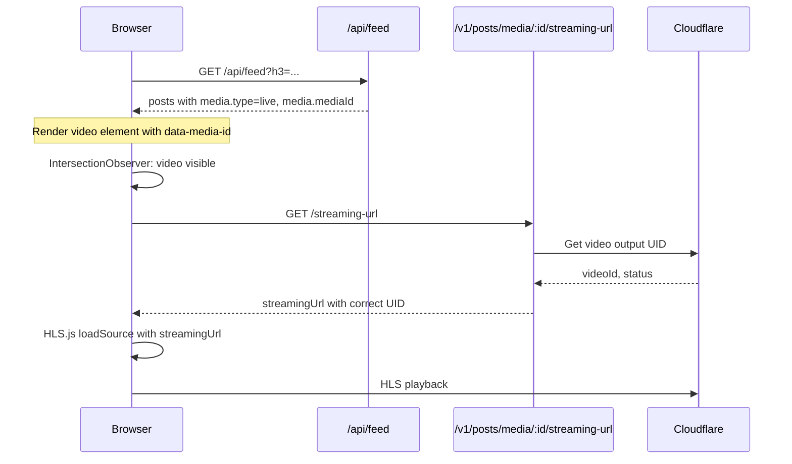

# Live Stream Playback Fix Plan

## Problem
Live stream posts show "Starting soon..." but the video is actually playable on Cloudflare. The stored `publicUrl` uses the **Live Input UID** which doesn't work for HLS playback. Cloudflare creates a separate **Video Output UID** when recording starts, which is needed for actual playback.

## Solution
Use the new `/v1/posts/media/:mediaId/streaming-url` endpoint documented in `api/post-media.md` to fetch the correct Video Output UID URL before playing live streams.

## Changes Required

### 1. API Changes (already partially done)

#### api/src/types.ts ✅
- Add `mediaId?: string` to `MediaInfo` type

#### api/src/routes/feed.ts
- Include `mediaId: docId` in live stream response

#### api/src/routes/search.ts  
- Include `mediaId: docId` in live stream response

### 2. Frontend Changes

#### web/public/app.js
1. Update `renderMedia()` for live type:
   - Store `data-media-id` attribute on video element
   - Keep `data-live="true"` flag
   
2. Update `initVideoPlayer()`:
   - Check if `data-live="true"` AND `data-media-id` exists
   - If so, fetch `/v1/posts/media/{mediaId}/streaming-url` first
   - Use returned `streamingUrl` instead of stored stream URL
   - Update badge based on returned status

#### web/public/favorites.js
- Same changes as app.js

## API Response Reference

```http
GET /v1/posts/media/:mediaId/streaming-url
```

```json
{
  "mediaId": "live-input-uid",
  "streamingUrl": "https://customer-xxx.cloudflarestream.com/<video-output-uid>/manifest/video.m3u8",
  "iframeUrl": "https://customer-xxx.cloudflarestream.com/<video-output-uid>/iframe",
  "videoId": "<video-output-uid>",
  "status": "live-inprogress",
  "type": "live",
  "cached": false
}
```

Status values:
- `live-inprogress` - Currently live
- `ready` - Recording available as VOD
- `pendingupload` - Recording processing
- `no_broadcast` - No broadcast started

## Implementation Flow



## Tasks Checklist

- [x] Add mediaId to MediaInfo type in api/src/types.ts
- [ ] Add mediaId to live response in api/src/routes/feed.ts
- [ ] Add mediaId to live response in api/src/routes/search.ts
- [ ] Update renderMedia() in web/public/app.js to add data-media-id
- [ ] Update initVideoPlayer() in web/public/app.js to call streaming-url endpoint
- [ ] Update renderMedia() in web/public/favorites.js similarly
- [ ] Update initVideoPlayer() in web/public/favorites.js similarly
- [ ] Test with actual live stream post
