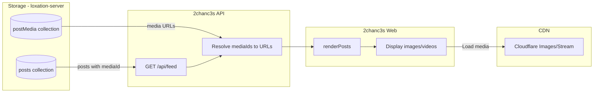

# Media Display Plan for 2chanc3s

## Overview

Display photos and videos in the 2chanc3s public web feed. Posts with media will show thumbnails that expand on click, with video streaming via HLS.

**Prerequisite:** loxation-server `mediaId` integration - see [`plans/post-media-integration.md`](post-media-integration.md)

## Data Flow



## Design Decision: Media URL Resolution

**Option A: Client-side resolution**
- API returns `mediaId` only
- Web fetches URLs via `GET /v1/posts/media/:mediaId` per post
- ❌ N+1 requests for feed with media

**Option B: Server-side resolution (Recommended)**
- API enriches posts with media URLs before returning
- Single feed request includes all URLs
- ✅ Better performance, simpler client

---

## Implementation Plan

### Phase 1: 2chanc3s API Changes

#### 1.1 Update Types

**File:** [`api/src/types.ts`](../api/src/types.ts)

```typescript
export type PostDoc = {
  deviceId: string;
  username?: string | null;
  messageId: string;
  time: string;
  content: string;
  contentType?: string;
  mediaId?: string | null;  // NEW
  geolocator?: {
    h3_res6?: string;
    h3_res7?: string;
    accuracyM?: number;
  } | null;
  locationSource?: "device" | "userProvided";
  geolocatorStatus?: "resolved" | "missing_device_location";
};

export type MediaInfo = {
  type: 'image' | 'video';
  thumbnail?: string;
  medium?: string;
  large?: string;
  public?: string;
  stream?: string;
  duration?: number;
};

export type PublicPost = {
  username: string;
  messageId: string;
  time: string;
  content: string;
  contentType?: string;
  media?: MediaInfo;  // NEW - resolved URLs
  geolocatorH3?: string;
  accuracyM?: number;
};
```

#### 1.2 Add Media Resolution Logic

**File:** [`api/src/routes/feed.ts`](../api/src/routes/feed.ts)

Add a function to batch-resolve media URLs:

```typescript
const MEDIA_COLLECTION = "postMedia";

type MediaDoc = {
  mediaId: string;
  type: 'image' | 'video';
  publicUrl: string;
  variants?: {
    thumbnail?: string;
    medium?: string;
    large?: string;
    public?: string;
  };
  thumbnail?: string;    // video thumbnail
  streamUrl?: string;    // video HLS
  duration?: number;
};

/**
 * Resolve media URLs for a batch of posts
 * Returns map of mediaId -> MediaInfo
 */
async function resolveMediaUrls(mediaIds: string[]): Promise<Map<string, MediaInfo>> {
  const result = new Map<string, MediaInfo>();
  if (mediaIds.length === 0) return result;

  const db = getDb();
  const uniqueIds = [...new Set(mediaIds.filter(Boolean))];
  
  // Batch get all media docs
  const mediaRefs = uniqueIds.map(id => db.collection(MEDIA_COLLECTION).doc(id));
  const snapshots = await db.getAll(...mediaRefs);
  
  for (const snap of snapshots) {
    if (!snap.exists) continue;
    const data = snap.data() as MediaDoc;
    
    if (data.type === 'image') {
      result.set(data.mediaId, {
        type: 'image',
        thumbnail: data.variants?.thumbnail,
        medium: data.variants?.medium,
        large: data.variants?.large,
        public: data.publicUrl || data.variants?.public,
      });
    } else if (data.type === 'video') {
      result.set(data.mediaId, {
        type: 'video',
        thumbnail: data.thumbnail,
        stream: data.streamUrl || data.publicUrl,
        duration: data.duration,
      });
    }
  }
  
  return result;
}
```

#### 1.3 Update toPublicPost and Feed Handler

```typescript
function toPublicPost(doc: PostDoc, mediaInfo?: MediaInfo): PublicPost | null {
  const username = typeof doc.username === "string" ? doc.username.trim() : "";
  if (!username) return null;
  if (typeof doc.messageId !== "string" || doc.messageId.trim() === "") return null;
  if (typeof doc.time !== "string" || doc.time.trim() === "") return null;
  if (typeof doc.content !== "string") return null;

  return {
    username,
    messageId: doc.messageId,
    time: doc.time,
    content: doc.content,
    contentType: doc.contentType || 'text/plain',
    media: mediaInfo,  // NEW
    geolocatorH3: doc.geolocator?.h3_res7,
    accuracyM: doc.geolocator?.accuracyM
  };
}

// In the feed handler, after fetching posts:
// 1. Collect all mediaIds from posts
const mediaIds = results
  .filter(doc => doc.mediaId)
  .map(doc => doc.mediaId as string);

// 2. Batch resolve media URLs
const mediaMap = await resolveMediaUrls(mediaIds);

// 3. Convert to PublicPost with media info
for (const doc of results) {
  const mediaInfo = doc.mediaId ? mediaMap.get(doc.mediaId) : undefined;
  const pub = toPublicPost(doc, mediaInfo);
  if (pub) merged.push(pub);
}
```

---

### Phase 2: 2chanc3s Web Frontend Changes

#### 2.1 Add CSS for Media Display

**File:** [`web/public/style.css`](../web/public/style.css)

```css
/* Media in posts */
.post-media {
  margin: 0.75rem 0;
  max-width: 100%;
}

.post-media img {
  max-width: 100%;
  max-height: 400px;
  object-fit: contain;
  border-radius: 8px;
  cursor: pointer;
  background: #1a1a2e;
}

.post-media video {
  max-width: 100%;
  max-height: 400px;
  border-radius: 8px;
  background: #000;
}

/* Lightbox overlay */
.lightbox {
  position: fixed;
  inset: 0;
  background: rgba(0, 0, 0, 0.95);
  display: flex;
  align-items: center;
  justify-content: center;
  z-index: 1000;
}

.lightbox.hidden {
  display: none;
}

.lightbox-close {
  position: absolute;
  top: 1rem;
  right: 1rem;
  font-size: 2rem;
  color: white;
  background: none;
  border: none;
  cursor: pointer;
  z-index: 1001;
}

.lightbox-content img {
  max-width: 95vw;
  max-height: 95vh;
  object-fit: contain;
}

.lightbox-content video {
  max-width: 95vw;
  max-height: 95vh;
}
```

#### 2.2 Add Lightbox HTML

**File:** [`web/public/index.html`](../web/public/index.html)

Add before `</body>`:

```html
<!-- Lightbox for full-size media -->
<div id="lightbox" class="lightbox hidden">
  <button class="lightbox-close" aria-label="Close">&times;</button>
  <div class="lightbox-content">
    
    <video id="lightbox-video" controls playsinline></video>
  </div>
</div>

<!-- HLS.js for video streaming (non-Safari browsers) -->
<script src="https://cdn.jsdelivr.net/npm/hls.js@1/dist/hls.min.js"></script>
```

#### 2.3 Update JavaScript

**File:** [`web/public/app.js`](../web/public/app.js)

Add media rendering functions:

```javascript
/**
 * Render media element for a post
 */
function renderMedia(media) {
  if (!media) return '';
  
  if (media.type === 'image') {
    const thumbUrl = media.medium || media.thumbnail || media.public;
    const fullUrl = media.large || media.public;
    if (!thumbUrl) return '';
    
    return `
      <div class="post-media">
        
      </div>
    `;
  }
  
  if (media.type === 'video') {
    const posterUrl = media.thumbnail || '';
    const streamUrl = media.stream;
    if (!streamUrl) return '';
    
    // Generate unique ID for this video element
    const videoId = 'video-' + Math.random().toString(36).slice(2, 9);
    
    return `
      <div class="post-media">
        <video 
          id="${videoId}"
          poster="${escapeText(posterUrl)}"
          controls
          playsinline
          preload="none"
          data-stream="${escapeText(streamUrl)}"
        >
          Your browser does not support video playback.
        </video>
      </div>
    `;
  }
  
  return '';
}

/**
 * Initialize HLS for a video element
 */
function initVideoPlayer(videoEl) {
  const streamUrl = videoEl.dataset.stream;
  if (!streamUrl) return;
  
  if (videoEl.canPlayType('application/vnd.apple.mpegurl')) {
    // Native HLS support (Safari, iOS)
    videoEl.src = streamUrl;
  } else if (typeof Hls !== 'undefined' && Hls.isSupported()) {
    // Use HLS.js for other browsers
    const hls = new Hls();
    hls.loadSource(streamUrl);
    hls.attachMedia(videoEl);
  } else {
    // Fallback - try direct source
    videoEl.src = streamUrl;
  }
}

/**
 * Lightbox functions
 */
function openLightbox(imgEl) {
  const lightbox = document.getElementById('lightbox');
  const lightboxImg = document.getElementById('lightbox-img');
  const lightboxVideo = document.getElementById('lightbox-video');
  
  lightboxImg.src = imgEl.dataset.full || imgEl.src;
  lightboxImg.style.display = 'block';
  lightboxVideo.style.display = 'none';
  lightbox.classList.remove('hidden');
  
  // Prevent body scroll
  document.body.style.overflow = 'hidden';
}

function closeLightbox() {
  const lightbox = document.getElementById('lightbox');
  const lightboxImg = document.getElementById('lightbox-img');
  const lightboxVideo = document.getElementById('lightbox-video');
  
  lightbox.classList.add('hidden');
  lightboxImg.src = '';
  lightboxVideo.pause();
  lightboxVideo.src = '';
  
  // Restore body scroll
  document.body.style.overflow = '';
}

// Initialize lightbox event listeners
document.addEventListener('DOMContentLoaded', () => {
  const lightbox = document.getElementById('lightbox');
  if (lightbox) {
    lightbox.querySelector('.lightbox-close')?.addEventListener('click', closeLightbox);
    lightbox.addEventListener('click', (e) => {
      if (e.target === lightbox) closeLightbox();
    });
  }
});

// Close lightbox on Escape key
document.addEventListener('keydown', (e) => {
  if (e.key === 'Escape') closeLightbox();
});
```

Update `renderPosts()` to include media:

```javascript
function renderPosts(posts) {
  listEl.innerHTML = '';
  if (!posts || posts.length === 0) {
    listEl.innerHTML = '<div class="post">No posts found.</div>';
    return;
  }

  for (const p of posts) {
    const username = p.username;
    const messageId = p.messageId;
    const full = p.content || '';
    const snippet = full.length > 240 ? full.slice(0, 240) + '…' : full;
    const hasMore = full.length > snippet.length;
    const hasMedia = p.media && (p.media.type === 'image' || p.media.type === 'video');

    const el = document.createElement('div');
    el.className = 'post';
    el.innerHTML = `
      <div class="meta">
        <div>@${escapeText(username)}</div>
        <div>${escapeText(fmtTime(p.time))}</div>
        <div class="mono">id: ${escapeText(messageId)}</div>
      </div>
      ${renderMedia(p.media)}
      <div class="content" data-full="${escapeText(full)}" data-snippet="${escapeText(snippet)}">${escapeText(snippet)}</div>
      <div class="actions">
        <a class="btn" href="${replyUrl(username, messageId)}">Reply (in app)</a>
        ${hasMore && !hasMedia ? '<button class="btn toggle">Show full</button>' : ''}
      </div>
    `;
    
    // Toggle button for text content
    const toggle = el.querySelector('button.toggle');
    if (toggle) {
      toggle.addEventListener('click', () => {
        const contentEl = el.querySelector('.content');
        const isFull = toggle.dataset.mode === 'full';
        if (isFull) {
          contentEl.textContent = contentEl.dataset.snippet;
          toggle.textContent = 'Show full';
          toggle.dataset.mode = 'snippet';
        } else {
          contentEl.textContent = contentEl.dataset.full;
          toggle.textContent = 'Show less';
          toggle.dataset.mode = 'full';
        }
      });
    }
    
    listEl.appendChild(el);
  }
  
  // Initialize video players after DOM is updated
  document.querySelectorAll('.post-media video[data-stream]').forEach(initVideoPlayer);
}
```

---

## Implementation Checklist

### 2chanc3s API (`api/`)
- [ ] Add `MediaInfo` type to `types.ts`
- [ ] Add `mediaId` to `PostDoc` type
- [ ] Add `media` to `PublicPost` type
- [ ] Add `resolveMediaUrls()` function in `feed.ts`
- [ ] Update `toPublicPost()` to accept `mediaInfo` parameter
- [ ] Update feed handler to batch-resolve media before returning
- [ ] Test with posts that have `mediaId` set

### 2chanc3s Web (`web/public/`)
- [ ] Add media CSS styles to `style.css`
- [ ] Add lightbox HTML to `index.html`
- [ ] Add hls.js script tag to `index.html`
- [ ] Add `renderMedia()` function to `app.js`
- [ ] Add `initVideoPlayer()` function to `app.js`
- [ ] Add lightbox functions to `app.js`
- [ ] Update `renderPosts()` to include media
- [ ] Test image display and lightbox
- [ ] Test video playback (Safari + Chrome)

---

## Notes

### Performance Considerations

- **Batch resolution**: All media URLs are fetched in a single Firestore `getAll()` call, not N+1 queries
- **Lazy loading**: Images use `loading="lazy"` attribute
- **Video preload**: Videos use `preload="none"` to avoid bandwidth until play

### Browser Compatibility

| Feature | Safari | Chrome | Firefox |
|---------|--------|--------|---------|
| HLS Video | Native | hls.js | hls.js |
| Image lightbox | ✅ | ✅ | ✅ |
| Lazy loading | ✅ | ✅ | ✅ |

### Error Handling

- Missing media (deleted): Post displays normally without media block
- Failed media load: Browser shows broken image/video placeholder
- No special error UI needed (graceful degradation)
