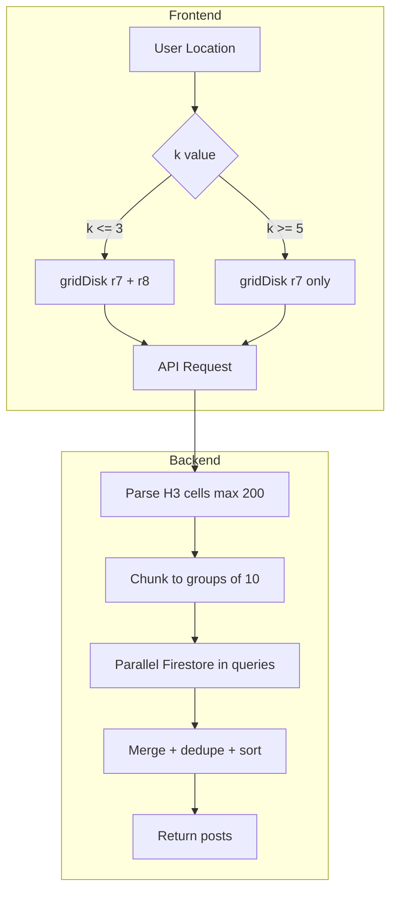

# Metro Radius Fix Plan

## Problem Statement

Posts are not appearing in the feed because the search radius is too restrictive. The current maximum `k=2` only covers ~8km diameter, which is insufficient for metropolitan areas (30-60km).

**Test case:** Post with H3 cell `872a930f0ffffff` is not appearing when browsing from the same metro area.

## Solution: Hybrid Resolution Approach

Add larger k values and intelligently switch between H3 resolutions based on search radius:

| k | Cells | Coverage | Strategy |
|---|-------|----------|----------|
| 1 | 7 | ~5km | r7 + r8 |
| 3 | 37 | ~12km | r7 + r8 |
| 5 | 91 | ~20km | r7 only |
| 10 | 331 | ~40km | r7 only |
| 15 | 721 | ~60km | r7 only |

For k ≤ 3: Use both r7 and r8 resolutions for granular nearby matching
For k ≥ 5: Use r7 only to reduce query volume while maintaining coverage

---

## Implementation Changes

### 1. web/public/index.html

Update the radius dropdown with friendly labels:

```html
<select id="k">
  <option value="1" selected>Nearby ~5km</option>
  <option value="3">Local ~12km</option>
  <option value="5">District ~20km</option>
  <option value="10">Metro ~40km</option>
  <option value="15">Region ~60km</option>
</select>
```

### 2. web/public/app.js

Update `computeH3Tokens()` to implement hybrid logic:

```javascript
function computeH3Tokens(lat, lng, k) {
  const cell7 = latLngToCell(lat, lng, 7);
  const r7 = Array.from(gridDisk(cell7, k));
  
  // For larger radii, skip r8 to reduce query volume
  if (k >= 5) {
    return { r7, r8: [] };
  }
  
  const cell8 = latLngToCell(lat, lng, 8);
  const r8 = Array.from(gridDisk(cell8, k));
  return { r7, r8 };
}
```

### 3. api/src/util/h3.ts

Increase max cells from 50 to 200:

```typescript
// In parseH3List, change max parameter usage
// The caller in feed.ts passes the max, so update feed.ts
```

### 4. api/src/routes/feed.ts

- Increase max H3 cells from 50 to 200
- Make h3r8 optional (allow queries with only r7)

```typescript
// Change line 63-64
const h3r7 = parseH3List(req.query.h3r7, 200);  // was 50
const h3r8 = parseH3List(req.query.h3r8, 200);  // was 50

// Change validation at line 67-73 to allow r7-only
if (h3r7.length === 0 && h3r8.length === 0) {
  return res.status(400).json({
    error: {
      code: "invalid_request",
      message: "h3r7 or h3r8 is required"
    }
  });
}
```

### 5. api/src/routes/search.ts

Apply same changes for consistency (increase max, allow r7-only).

---

## Architecture Diagram



---

## Performance Considerations

| k | r7 cells | r8 cells | Total | Firestore chunks | Est. queries |
|---|----------|----------|-------|------------------|--------------|
| 1 | 7 | 7 | 14 | 2 | 2 |
| 3 | 37 | 37 | 74 | 8 | 8 |
| 5 | 91 | 0 | 91 | 10 | 10 |
| 10 | 200* | 0 | 200 | 20 | 20 |
| 15 | 200* | 0 | 200 | 20 | 20 |

*Capped at 200 cells

The hybrid approach keeps query count reasonable while enabling metro-scale searches.

---

## Additional: Address/City Geocoding Input

Add a text input for typing an address or city name (e.g., "Cincinnati OH") to geocode into lat/lng coordinates. This solves laptop geolocation inaccuracy and allows searching other areas.

### Geocoding Options

| Service | Pros | Cons |
|---------|------|------|
| OpenStreetMap Nominatim | Free, no API key | Rate limited, less accurate |
| Google Geocoding API | Very accurate, fast | Requires API key, costs $ |
| Cloudflare Workers + Nominatim | Free at edge | Need to deploy worker |

**Recommended:** Use OpenStreetMap Nominatim for simplicity (free, client-side).

### Implementation

#### HTML (index.html)

Add address input:

```html
<div class="row">
  <input id="address" type="text" placeholder="Enter city or address..." />
  <button id="btnGeocode">Set Location</button>
  <span class="or-sep">or</span>
  <button id="btnLocate">Use my location</button>
</div>
```

#### JavaScript (app.js)

Add geocoding function using Nominatim:

```javascript
async function geocodeAddress(address) {
  const url = `https://nominatim.openstreetmap.org/search?format=json&q=${encodeURIComponent(address)}&limit=1`;
  const resp = await fetch(url, {
    headers: { 'User-Agent': '2chanc3s-web/1.0' }
  });
  const data = await resp.json();
  if (!data || data.length === 0) {
    throw new Error('Address not found');
  }
  return {
    latitude: parseFloat(data[0].lat),
    longitude: parseFloat(data[0].lon),
    displayName: data[0].display_name
  };
}

btnGeocode.addEventListener('click', async () => {
  const address = document.getElementById('address').value.trim();
  if (!address) {
    setStatus('Please enter an address or city');
    return;
  }
  
  setStatus('Geocoding address...');
  try {
    const geo = await geocodeAddress(address);
    const k = Number(kEl.value);
    lastH3 = computeH3Tokens(geo.latitude, geo.longitude, k);
    setStatus(`Location: ${geo.displayName.split(',')[0]} - Loading...`);
    await loadFeed();
  } catch (e) {
    setStatus(`Geocoding error: ${e.message}`);
  }
});
```

---

## Additional: Location Debugging

Since browser geolocation on laptops can be inaccurate (IP-based, often city-level), add debug info to help users verify their location is correct.

### Add debug display in app.js

In the btnLocate handler, show location info after getting position:

```javascript
const { latitude, longitude, accuracy } = lastGeo.coords;
const cell7 = latLngToCell(latitude, longitude, 7);
console.log(`Location: ${latitude.toFixed(5)}, ${longitude.toFixed(5)} (±${accuracy}m)`);
console.log(`Your H3 r7: ${cell7}`);
setStatus(`Location: ${latitude.toFixed(4)}, ${longitude.toFixed(4)} (±${Math.round(accuracy)}m) - Loading...`);
```

This lets users:
1. See their detected coordinates
2. Compare their H3 cell with the post H3 cell `872a930f0ffffff`
3. Verify if they are actually in the expected area

---

## Testing

1. Deploy changes
2. Open site and click Use my location
3. Check that location debug info shows reasonable coordinates
4. Select Metro ~40km radius
5. Verify post with H3 `872a930f0ffffff` appears
6. Test all radius options work correctly
