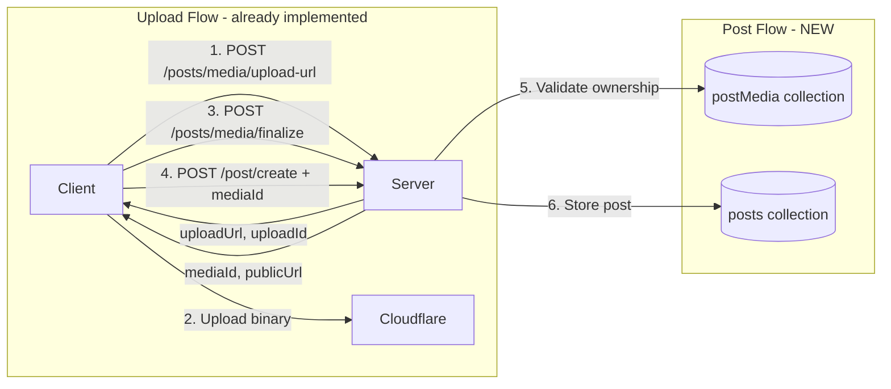

# Post Media Integration Plan

**Date:** January 14, 2026  
**Status:** Ready for Implementation  
**Requested by:** loxation-sw (iOS) and 2chanc3s (Web) teams

## Summary

Add optional `mediaId` parameter to `/v1/post/create` endpoint to associate uploaded media (images/videos) with public posts.

## Design Decisions

| Decision | Choice | Rationale |
|----------|--------|-----------|
| Storage approach | Simple `mediaId` field | Minimal complexity, matches client needs |
| Reference counting | None | Posts/media have independent lifecycles |
| Media reuse | Allowed | Users can reference same media in multiple posts |
| Deleted media handling | Graceful degradation | Clients handle missing media |
| Content type semantics | MIME types | `image/jpeg`, `video/mp4` instead of generic "media" |

## Architecture



## Data Model Changes

### posts Collection

Add `mediaId` field to existing document structure:

```typescript
// Document id: ${deviceId}:${messageId}
{
  deviceId: string,
  username: string,
  messageId: string,
  time: string,
  content: string,
  contentType: string,        // text/plain, image/jpeg, video/mp4, etc.
  geolocator: {...},
  locationSource: string,
  geolocatorStatus: string,
  mediaId: string | null      // NEW - reference to postMedia document
}
```

### No changes to postMedia collection

The existing `postMedia` collection already stores:
- `mediaId`, `type`, `publicUrl`, `variants`
- `deviceId` (ownership), `locationId`, `finalizedAt`

## API Changes

### POST /v1/post/create

#### Updated Request Schema

```json
{
  "message": "Check out this sunset!",
  "messageId": "uuid-1234",
  "username": "johndoe",
  "contentType": "image/jpeg",
  "location": {
    "latitude": 37.7749,
    "longitude": -122.4194,
    "accuracyM": 250
  },
  "mediaId": "abc123-def456"
}
```

| Field | Type | Required | Description |
|-------|------|----------|-------------|
| `message` | string | Yes | Post content text |
| `messageId` | string | Yes | Client-generated unique ID |
| `username` | string | Yes | Display username |
| `contentType` | string | No | MIME type - default: `text/plain` |
| `location` | object | No | Coordinates for geolocator |
| `mediaId` | string | No | **NEW** - Reference to finalized media |

#### Content Type Values

| contentType | mediaId | Description |
|-------------|---------|-------------|
| `text/plain` | null/absent | Text-only post |
| `image/jpeg` | required | Post with JPEG image |
| `image/png` | required | Post with PNG image |
| `image/gif` | required | Post with GIF image |
| `image/webp` | required | Post with WebP image |
| `video/mp4` | required | Post with MP4 video |
| `video/quicktime` | required | Post with MOV video |

#### Validation Rules

1. If `mediaId` is provided:
   - Media document must exist in `postMedia` collection
   - Media `deviceId` must match authenticated caller
   - `contentType` should match media type (warning if mismatch)

2. If `mediaId` is absent/null:
   - `contentType` defaults to `text/plain`

#### Error Responses

| Status | Code | Condition |
|--------|------|-----------|
| 400 | `media_not_found` | mediaId does not exist |
| 403 | `forbidden` | Media not owned by caller |
| 400 | `invalid_request` | mediaId present but contentType is text/plain |

## Implementation Steps

### Step 1: Update src/routes/post.ts

Location: [`src/routes/post.ts`](../src/routes/post.ts) lines 116-234

```typescript
// 1. Add mediaId to request body destructuring (line ~125)
const { message, messageId, username, contentType, location, mediaId } = req.body as {
  // ... existing types
  mediaId?: unknown;
};

// 2. Add media validation after username check (line ~147)
let validatedMediaId: string | null = null;
if (mediaId !== undefined && mediaId !== null) {
  if (typeof mediaId !== 'string' || mediaId.trim().length === 0) {
    return res.status(400).json({
      error: { code: 'invalid_request', message: 'mediaId must be a non-empty string' }
    });
  }
  
  const mediaDoc = await db.collection('postMedia').doc(mediaId).get();
  if (!mediaDoc.exists) {
    return res.status(400).json({
      error: { code: 'media_not_found', message: 'Referenced media does not exist' }
    });
  }
  
  const mediaData = mediaDoc.data() as { deviceId: string };
  if (mediaData.deviceId !== deviceId) {
    return res.status(403).json({
      error: { code: 'forbidden', message: 'Not authorized to use this media' }
    });
  }
  
  validatedMediaId = mediaId;
}

// 3. Add mediaId to postData object (line ~200)
const postData = {
  deviceId,
  username,
  messageId,
  time: nowIso,
  content: message,
  contentType: effectiveContentType,
  geolocator,
  locationSource,
  geolocatorStatus,
  mediaId: validatedMediaId  // NEW
};
```

### Step 2: Update API Documentation

Update [`docs/api/post-media.md`](../docs/api/post-media.md) Integration with Posts section.

### Step 3: Update 2chanc3s Documentation

Update [`/Users/jon/Documents/GitHub/2chanc3s/post.md`](/Users/jon/Documents/GitHub/2chanc3s/post.md) to document the new field.

## Test Cases

### Happy Path
1. Upload image → finalize → create post with mediaId → success
2. Create post without mediaId → success with text/plain

### Error Cases
3. Create post with non-existent mediaId → 400 media_not_found
4. Create post with another device's mediaId → 403 forbidden
5. Create post with empty string mediaId → 400 invalid_request

### Edge Cases
6. Create post with same mediaId twice (reuse) → success
7. Delete media, then fetch post → post returns normally, client handles missing media
8. Create post with image mediaId but contentType video/mp4 → warning logged, success

## Backward Compatibility

- Existing clients sending no `mediaId` continue to work unchanged
- Response schema unchanged (mediaId not returned in response per iOS request)
- Existing posts unaffected

## Future Considerations

### Not in Scope (Phase 2+)
- **Rich content blocks**: `application/vnd.loxation.rich+json` with multiple media
- **Content-addressed IDs**: `hash(binary + timestamp)` generation
- **Reference counting**: Track which posts use which media
- **Orphan cleanup**: Batch job to delete unreferenced media

## Files to Modify

| File | Change |
|------|--------|
| `src/routes/post.ts` | Add mediaId validation and storage |
| `docs/api/post-media.md` | Update Integration section |
| `../2chanc3s/post.md` | Add mediaId to request schema |

## Estimated Scope

- Code changes: ~30 lines in post.ts
- Documentation: Update 2 files
- Testing: 8 test scenarios
