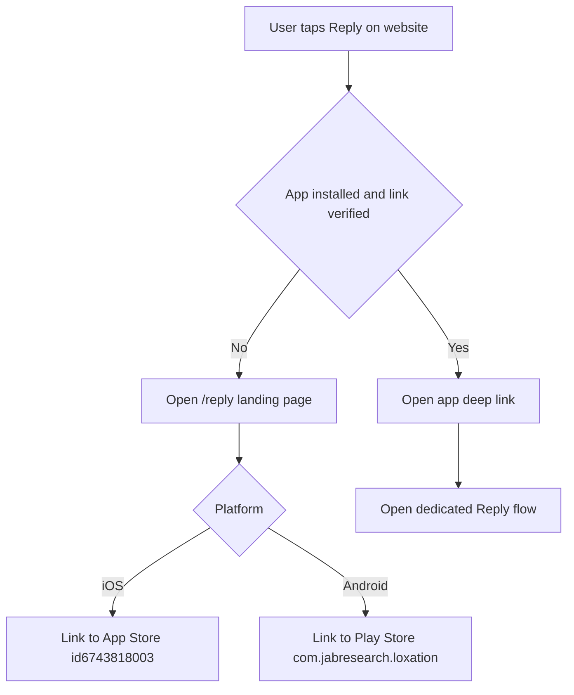

# Plan: Public Missed Connections Web Server + Reply Deep Links

## Scope

Build a new TypeScript Node server for a public, anonymous, retro Craigslist-style feed of posts stored in the same Firebase/Firestore project referenced by [`.env`](../.env:1).

Key requirements:

- Anonymous browsing of nearby posts (coarse location only).
- Show: username, post text, coarse geolocation indicator, timestamp.
- A per-post **Reply** action that:
  - opens the Loxation app when installed
  - otherwise routes to install the app
  - then deep-links into a **dedicated Reply flow** in-app (equivalent to `/reply <username> <messageId>` in [`missed_connections_commands_plan.md`](../missed_connections_commands_plan.md:48)).

## Inputs and constraints

### Post data model (authoritative)

Posts are created by the existing server route pasted from [`../loxation-server/src/routes/post.ts`](../loxation-server/src/routes/post.ts:1), which writes Firestore:

- Collection: `posts`
- Doc id: `${deviceId}:${messageId}`
- Fields written are consistent with [`post.md`](../post.md:21):
  - `deviceId`, `messageId`, `time` (ISO), `content`, `contentType`
  - `geolocator` either `null` or `{ h3, accuracyM }`
  - `locationSource`, `geolocatorStatus`

Update: [`post.md`](../post.md:29) specifies `username?: string | null` on each post document.

Alignment update: the pasted implementation of [`../loxation-server/src/routes/post.ts`](../loxation-server/src/routes/post.ts:1) has now been extended to populate `username` on write via `getDeviceUsername()` by reading Firestore `users` docs (candidate ids like `${deviceId}:${locationId}` and `${deviceId}:global`).

Implication: the public web server can treat `posts.username` as the primary display field.

Policy: if `posts.username` is `null` or empty, the post should be skipped from the public feed (to enforce the requirement that posts are attributable to a username for the Reply flow).

### Deep linking direction

We will use a **single HTTPS host** by default:

- `https://www.2chanc3s.com`

This host must serve both the public website and the verification endpoints required for Universal Links (iOS) and App Links (Android).

## Public website URL contract

### Canonical routes

- `GET /` : retro feed UI
- `GET /p/:messageId` : single post detail
- `GET /reply` : reply landing page
  - query params
    - `username` required
    - `messageId` required
    - optional `k` for wider nearby feed when returning to list

### Canonical reply link (generated per post)

`https://www.2chanc3s.com/reply?username=<u>&messageId=<id>`

In-app behavior is explicitly the dedicated Reply flow described in [`missed_connections_commands_plan.md`](../missed_connections_commands_plan.md:48).

## Deep link + install behavior

### Primary mechanism

Use HTTPS Universal Links and Android App Links on the `/reply` path.

- If app installed and links verified: tapping the Reply link opens the app.
- If app not installed: the link opens the website `/reply` landing page.

### Required platform verification files

These values are needed from the mobile team:

- iOS bundle id and Apple Team ID (AASA requires `TEAMID.bundleid`; App Store id alone is not enough)
- Android signing certificate SHA256 fingerprint(s)

Web server should be able to serve:

- `GET /.well-known/apple-app-site-association`
- `GET /.well-known/assetlinks.json`

Note: this plan does not hardcode these values; the server should read them from env vars at deploy.

### Install fallback targets

- iOS App Store
  - URL: `https://apps.apple.com/app/id6743818003`
- Android Play Store
  - Canonical URL: `https://play.google.com/store/apps/details?id=com.jabresearch.loxation`

### Reply landing page behavior

When `/reply` is opened in a browser (typically because the app is not installed or link verification is not active), render a landing page that:

1) Explains: reply is sent privately inside the app.
2) Shows the target:
   - `@username`
   - `messageId`
   - short excerpt of the referenced post if available
3) Provides buttons:
   - Primary: `Install Loxation` (platform-specific store)
   - Secondary: `Open in app` (best-effort fallback)

Fallback mechanics:

- Android: optionally use an `intent://` link with `package=com.jabresearch.loxation` and `S.browser_fallback_url` to Play Store.
- iOS: avoid aggressive auto-redirect; allow a user gesture. If a custom scheme exists, it can be used only as a button action.

## Nearby feed: H3 query plan

### Goals

- Visitor location never persisted.
- Use only coarse H3 tokens.
- Default to server-chosen post resolution (res 7 or 8 per the create logic in the pasted `chooseH3Resolution()` from [`../loxation-server/src/routes/post.ts`](../loxation-server/src/routes/post.ts:1)).
- Allow visitor to broaden the query.

### Browser side

- Ask for geolocation permission.
- Convert coordinates to H3 cells using `h3-js` in the browser.
- Compute both:
  - visitor cell at res 7
  - visitor cell at res 8
- Compute neighbors using `gridDisk`.

Query params sent to server API:

- `h3r7`: comma-separated res 7 tokens
- `h3r8`: comma-separated res 8 tokens
- `k`: integer neighbor radius
  - default `k=1`
  - clamp to `k<=2` to control query explosion

Optional widening controls (to match your note about letting visitors query wider):

- `k` increases neighbor radius (primary widening mechanism)
- `res=7` can force a coarser-only query (optional; if used, server ignores `h3r8`)

Validation rules:

- `k` default 1; clamp `0..2`
- `limit` default 50; clamp `1..100`
- `res` allowlist `{7,8}` only

Rationale: because posts may be stored at res 7 or res 8, querying both avoids missing posts.

### Server side Firestore queries

Firestore constraints:

- `in` query supports up to 10 values.
- Combining multiple H3 buckets requires multiple queries and merging results.

Strategy:

0) Prefer skipping posts missing `username` in memory unless Firestore inequality constraints allow an efficient filter.

1) Build `h3Tokens` as:
   - `h3r7` tokens split and validated
   - `h3r8` tokens split and validated
2) For each group (r7, r8):
   - chunk tokens into arrays of max size 10
   - for each chunk run:
     - `collection('posts')`
     - `where('geolocator.h3', 'in', chunk)`
     - `orderBy('time', 'desc')`
     - `limit(NperChunk)`
3) Merge results in memory:
   - de-dup by doc id
   - sort by `time desc`
   - filter out missing/empty `username`
   - take top `N`

Notes:

- If we attempt `where('username','!=',null)`, Firestore may require `orderBy('username')` first. That complicates sorting by `time`.
- For v1, simplest is: query by H3 + time, then filter missing usernames in memory and overfetch (increase `NperChunk`) to keep result count stable.

Pagination:

- Initial implementation: no cursor pagination across merged queries.
- Phase 2: introduce a materialized query key on write to enable single-query pagination.

Phase 2 options for a single-query feed:

- Write `h3r7` and `h3r8` fields at creation time:
  - `h3r7 = cellToParent(geolocator.h3, 7)`
  - `h3r8 = cellToParent(geolocator.h3, 8)`
  - then query one of those deterministically.
- Or write `feedBucket` as `h3@res7` only.

Indexes:

- Composite index likely needed: `geolocator.h3` + `time desc`.

If a `username` inequality filter is used in the future, additional composite indexes may be needed.

## Username resolution plan

Because older posts may not yet have `username` populated in Firestore, the web server must be resilient.

Recommended path (best performance):

1) **Write-through** `username` onto the `posts` document at create time (as specified in [`post.md`](../post.md:29)).
   - This is now implemented in the updated route via `getDeviceUsername()` in [`../loxation-server/src/routes/post.ts`](../loxation-server/src/routes/post.ts:1).

Alternative path (no changes to existing server):

1) Query posts.
2) For any post with `username` missing, extract unique `deviceId`s.
3) Batch-resolve to usernames from a `users` collection.
   - Requires confirming the exact doc id format and field name for username.
   - Cache results in memory (LRU) to reduce Firestore reads.

Given the product requirement that Reply links are username-based, writing `username` onto each post is strongly preferred.

## TypeScript server shape

### Proposed stack

- Node 20+
- TypeScript
- Express or Fastify
- Server-rendered HTML (no heavy frontend framework)
- `firebase-admin` using Application Default Credentials on GCP

Recommended choice:

- Fastify (better built-in performance and schema validation), but Express is also acceptable to mirror the existing server.

### Endpoints

HTML:

- `GET /` render shell and load feed via embedded JSON or fetch
- `GET /p/:messageId` render post detail and Reply CTA
- `GET /reply` render install or open-in-app landing

JSON API:

- `GET /api/feed` params: `h3r7`, `h3r8`, `k`, `limit`
- `GET /api/post/:messageId` fetch one post (by doc id prefix match or by indexed field)

Post detail lookup note:

- Firestore doc id is `${deviceId}:${messageId}`, but the public site URL is keyed by `messageId`.
- Fetch by `messageId` via an indexed field (already present per [`post.md`](../post.md:29)):
  - `where('messageId','==',messageId)`
  - `limit(1)`

Verification:

- `GET /.well-known/apple-app-site-association`
- `GET /.well-known/assetlinks.json`

These should be served with:

- `Cache-Control: public, max-age=300`
- correct `Content-Type` (`application/json`)

## Security and abuse controls

- HTML output: escape all user content (post body and username).
- Add CSP headers (script-src self, style-src self, disallow inline where feasible).
- Add basic rate limiting on `/api/*`.
- Add cache headers for public feed responses with short TTL.
- `robots.txt` and meta noindex if desired during early rollout.

Additional:

- Do not render raw H3 tokens in the UI by default.
- Enforce max post length displayed (and show a truncated excerpt) to reduce abuse impact.

## Deployment

- Deploy to Cloud Run.
- Set env vars for Firebase project id and verification JSON values.
- Use the same Firebase project as in [`.env`](../.env:1).

Required env vars (proposal):

- `PORT`
- `FIREBASE_PROJECT_ID` (or rely on ADC)
- `CANONICAL_HOST=www.2chanc3s.com`
- `IOS_APP_STORE_URL=https://apps.apple.com/app/id6743818003`
- `ANDROID_PLAY_URL=https://play.google.com/store/apps/details?id=com.jabresearch.loxation`
- `AASA_JSON` or `IOS_TEAM_ID` + `IOS_BUNDLE_ID` (to synthesize)
- `ASSETLINKS_JSON` or `ANDROID_SHA256_CERT_FINGERPRINTS` (to synthesize)

## Acceptance criteria

1) Public feed

- When a visitor grants location access, the site shows a list of posts near their H3 cell.
- Each item displays `@username`, timestamp, short content excerpt, and a coarse location label.
- Posts with `username` missing are not displayed.

2) Post detail

- Visiting `GET /p/:messageId` renders exactly one post (or 404).
- Reply link points to `GET /reply?username=<u>&messageId=<id>`.

3) Reply deep link + install fallback

- On iOS with app installed and Universal Links verified, tapping Reply opens the app into the dedicated Reply flow.
- On Android with app installed and App Links verified, tapping Reply opens the app into the dedicated Reply flow.
- When the app is not installed, Reply opens the web landing page with a clear install CTA that leads to:
  - iOS: `https://apps.apple.com/app/id6743818003`
  - Android: `https://play.google.com/store/apps/details?id=com.jabresearch.loxation`

## Manual test checklist

- iOS Safari
  - open `https://www.2chanc3s.com/`
  - allow location
  - verify nearby feed loads
  - click Reply on a post
    - app installed: opens app
    - app not installed: opens landing and App Store

- Android Chrome
  - same flow with Play Store fallback

- Desktop browser
  - feed loads (location prompt or city fallback, if implemented)
  - Reply shows landing with both store links

## Mermaid: Web reply flow

## Open items to confirm with mobile team

1) iOS
   - Apple Team ID (for AASA)
   - iOS bundle id (for AASA)
   - Whether a custom URL scheme exists for optional fallback button

2) Android
   - SHA256 signing cert fingerprint for asset links

3) App deep link routing
   - confirm app will handle `/reply?username=...&messageId=...` and open the dedicated Reply composer
