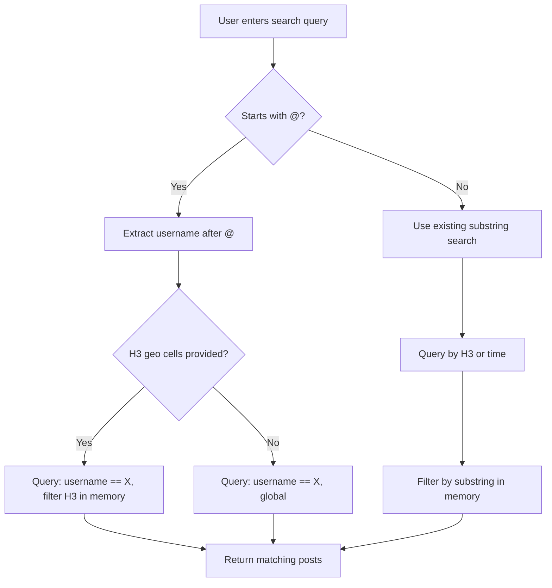

# Username Search Plan

## Overview

When the search query starts with `@`, the system should find all posts by that exact username instead of doing a substring search across content and username.

**Example**: `@john` returns all posts by the user "john" (exact match, case-insensitive).

## Current Behavior

From [`api/src/routes/search.ts:134-135`](api/src/routes/search.ts:134):
```typescript
const hay = `${pub.username} ${pub.content}`.toLowerCase();
if (!hay.includes(q)) continue;
```

The current search:
1. Queries Firestore by H3 cell (geographic filter) or by time (no geo filter)
2. Scans up to `maxScan` (default 500) posts
3. Filters in-memory by checking if `username + content` contains the query substring

This works but is inefficient for username searches since we're scanning potentially thousands of posts to find ones by a specific user.

## Proposed Solution

### API Changes ([`api/src/routes/search.ts`](api/src/routes/search.ts:1))

Detect `@username` queries and use a Firestore equality filter on the `username` field:

```typescript
// Detect @username search
const isUsernameSearch = q.startsWith('@') && q.length > 1;
const usernameToFind = isUsernameSearch ? q.slice(1).toLowerCase() : null;
```

When `isUsernameSearch` is true:
1. Use `where('username', '==', usernameToFind)` in the Firestore query
2. Skip the in-memory substring filter since Firestore handles the match
3. Still apply H3 geo-filtering if provided (find posts by user in this area)

**Query Strategy**:

```
┌─────────────────────────────────────────────────────────┐
│ Search: @john                                           │
├─────────────────────────────────────────────────────────┤
│ With H3 cells:                                          │
│   .where username == john                               │
│   .where geolocator.h3_res7 in [cells...]               │
│   .orderBy time desc                                    │
│   .limit 100                                            │
├─────────────────────────────────────────────────────────┤
│ Without H3 cells - global search:                       │
│   .where username == john                               │
│   .orderBy time desc                                    │
│   .limit 100                                            │
└─────────────────────────────────────────────────────────┘
```

**Firestore Consideration**: When combining `where('username', '==', ...)` with `where('geolocator.h3_res7', 'in', ...)`, Firestore may require a composite index. The fallback is to:
1. Query by username only
2. Filter by H3 in memory

### Web Client Changes ([`web/public/app.js`](web/public/app.js:412))

Minimal changes needed - the `@` prefix is passed to the API as-is.

Optional UX improvements:
1. Update search placeholder text to indicate `@username` support
2. Adjust minimum character validation (currently 2 chars) to allow `@a` as a valid username search

## Implementation Details

### API: [`api/src/routes/search.ts`](api/src/routes/search.ts:51)

```typescript
router.get(
  "/search",
  asyncHandler(async (req, res) => {
    const qRaw = typeof req.query.q === "string" ? req.query.q : "";
    const q = qRaw.trim().toLowerCase();
    
    // Detect @username search
    const isUsernameSearch = q.startsWith('@') && q.length > 1;
    const targetUsername = isUsernameSearch ? q.slice(1) : null;
    
    // Adjust validation - for @username, only need 2 chars total like @a
    if (q.length < 2 || q.length > 80) {
      return res.status(400).json({
        error: { code: "invalid_request", message: "q must be 2..80 characters" }
      });
    }

    // ... existing limit, maxScan, h3 parsing ...

    let candidates;
    
    if (isUsernameSearch && targetUsername) {
      // Username search - use Firestore equality filter on username
      if (all.length > 0) {
        // With geo filter - use composite index: username + h3 + time
        // Chunk H3 cells into groups of 10 (Firestore 'in' limit)
        const chunks: string[][] = [];
        for (let i = 0; i < all.length; i += 10) chunks.push(all.slice(i, i + 10));
        
        const docs: FirebaseFirestore.QueryDocumentSnapshot[] = [];
        for (const chunk of chunks) {
          const snap = await db
            .collection(POSTS_COLLECTION)
            .where("username", "==", targetUsername)
            .where(h3Field, "in", chunk)
            .orderBy("time", "desc")
            .limit(Math.ceil(maxScan / chunks.length))
            .get();
          docs.push(...snap.docs);
        }
        candidates = { docs };
      } else {
        // Global username search - no geo filter
        candidates = await db
          .collection(POSTS_COLLECTION)
          .where("username", "==", targetUsername)
          .orderBy("time", "desc")
          .limit(maxScan)
          .get();
      }
    } else {
      // Existing substring search logic
      // ... keep current H3-based queries ...
    }

    const matches: PublicPost[] = [];
    const seen = new Set<string>();
    
    for (const docSnap of candidates.docs) {
      const data = docSnap.data() as PostDoc;
      const pub = toPublicPost(data);
      if (!pub) continue;

      // For regular search, apply substring filter
      if (!isUsernameSearch) {
        const hay = `${pub.username} ${pub.content}`.toLowerCase();
        if (!hay.includes(q)) continue;
      }

      const key = `${pub.username}:${pub.messageId}:${pub.time}`;
      if (seen.has(key)) continue;
      seen.add(key);
      matches.push(pub);
      if (matches.length >= limit) break;
    }

    res.setHeader("Cache-Control", "public, max-age=10");
    return res.status(200).json({ posts: matches });
  })
);
```

### Web: [`web/public/app.js`](web/public/app.js:412)

Update the search placeholder in [`web/public/index.html:54`](web/public/index.html:54):
```html
<input id="search" type="search" placeholder="search posts… or @username" />
```

### Firestore Composite Indexes

Composite indexes are required for efficient queries. Add to `firestore.indexes.json`:

```json
{
  "indexes": [
    {
      "collectionGroup": "posts",
      "queryScope": "COLLECTION",
      "fields": [
        { "fieldPath": "username", "order": "ASCENDING" },
        { "fieldPath": "time", "order": "DESCENDING" }
      ]
    },
    {
      "collectionGroup": "posts",
      "queryScope": "COLLECTION",
      "fields": [
        { "fieldPath": "username", "order": "ASCENDING" },
        { "fieldPath": "geolocator.h3_res7", "order": "ASCENDING" },
        { "fieldPath": "time", "order": "DESCENDING" }
      ]
    },
    {
      "collectionGroup": "posts",
      "queryScope": "COLLECTION",
      "fields": [
        { "fieldPath": "username", "order": "ASCENDING" },
        { "fieldPath": "geolocator.h3_res6", "order": "ASCENDING" },
        { "fieldPath": "time", "order": "DESCENDING" }
      ]
    }
  ]
}
```

Deploy with:
```bash
firebase deploy --only firestore:indexes
```

These indexes enable:
1. **Global username search**: `where('username', '==', 'john').orderBy('time', 'desc')`
2. **Username + geofence (res7)**: `where('username', '==', 'john').where('geolocator.h3_res7', 'in', cells).orderBy('time', 'desc')`
3. **Username + geofence (res6)**: `where('username', '==', 'john').where('geolocator.h3_res6', 'in', cells).orderBy('time', 'desc')`

Results automatically sorted **most recent → least recent**.

## Flow Diagram



## Summary of Changes

| File | Change |
|------|--------|
| [`api/src/routes/search.ts`](api/src/routes/search.ts:1) | Add @username detection, Firestore username equality filter with optional H3 geo filtering |
| [`web/public/index.html`](web/public/index.html:54) | Update search placeholder text to indicate @username support |
| `firestore.indexes.json` | Add 3 composite indexes for username searches |

## Benefits

1. **Performance**: Direct Firestore index lookup vs scanning 500+ posts in memory
2. **Accuracy**: Exact username match vs substring match (e.g., "@john" won't match "johnny")
3. **Geo-scoped results**: Can find posts by a user within a specific area using H3 geo filtering
4. **UX**: Clear way to find all posts by a specific user, sorted most recent first
